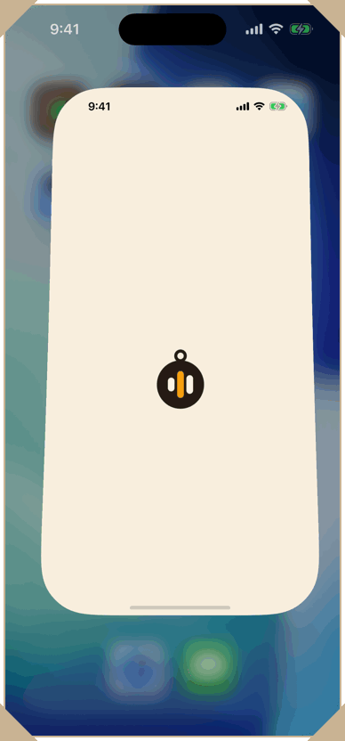
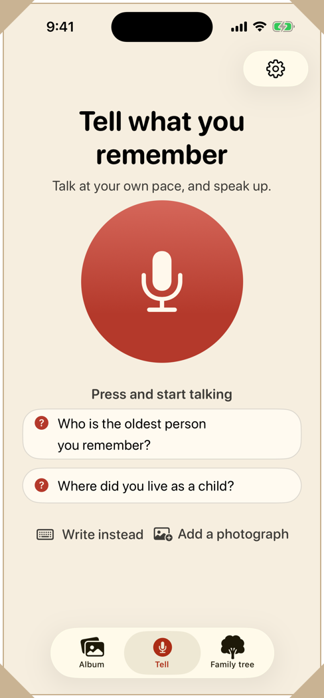
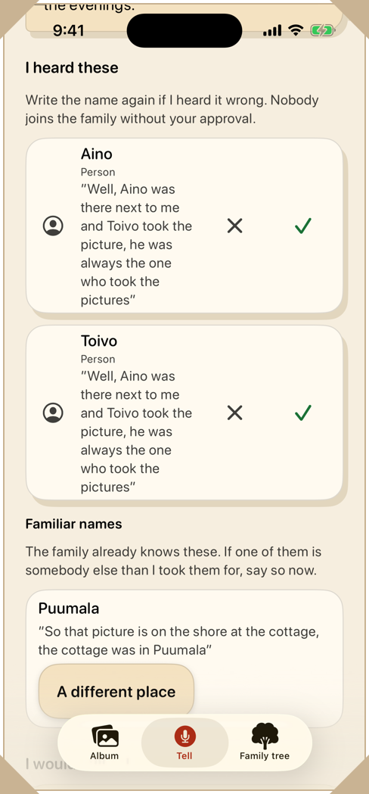
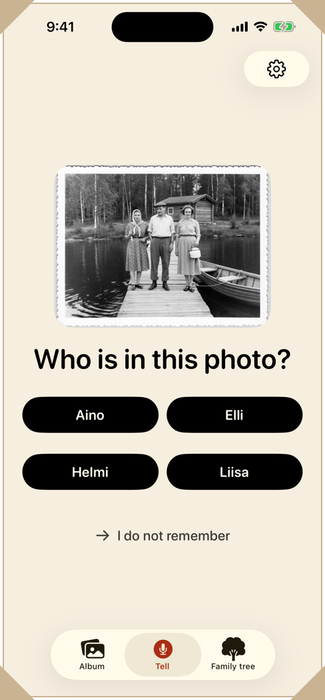

<p align="center">
  <picture>
    <source media="(prefers-color-scheme: dark)" srcset="docs/logo/title-plate-dark.svg">
    
  </picture>
</p>

<p align="center">
  <a href="LICENSE"></a>
</p>

A family's shared memory archive. Anyone in the family tells what they
remember, out loud or in writing, and the AI gives it structure: memories
attach to photos and people, the family tree grows out of the stories, and open
questions come back to be asked.

Album and genealogy apps ask for structured input: a form to fill in, a face to
tag, a date to pick. A family's memory is not kept that way. It is told, a
little at a time and by different people, and whatever nobody wrote down goes
when they do. Kinlore keeps the telling and does the sorting itself.

Everyone tells into the same archive from their own phone, and the app is built
for the oldest teller as much as for the youngest. My own grandparent tested
it, which is why the rules further down read as constraints rather than good
intentions, and why the failure that matters here is not a crash but a story
that never got told.

I built it for the [RevenueCat Shipaton 2026](https://revenuecat-shipaton-2026.devpost.com/)
hackathon, in the Next Gen Award (the student category).

<p align="center">
  
</p>

<p align="center"><sub>Simulator, stub pipeline: the waiting is real and the model call is canned.<br><code>scripts/readme-shots.sh</code> makes this GIF and the pictures below.</sub></p>

| <a href="docs/media/01-tell.png"></a> | <a href="docs/media/02-result.png"></a> | <a href="docs/media/03-who-is-this.png"></a> |
|---|---|---|
| **Telling.** One button, and a way out of it for anyone who would rather type. | **What comes back.** The date is a decade because that is what was said, and no name enters the family tree before somebody confirms it. | **Who is this?** One of the four names is the proposal, and nothing on the screen says which. |

<p align="center">
  <picture>
    <source media="(prefers-color-scheme: dark)" srcset="docs/logo/divider-dark.svg">
    
  </picture>
</p>

## What it does

- You press one big button and talk about an old photo. The memory is kept in
  your own voice and in readable words, attached to the photo.
- The names and places it heard come back as proposals, each with the sentence
  it was heard in. None of them enters the family tree until a person says yes
  (rule 4).
- It asks follow-up questions out loud, listens to each answer and asks the
  next one, round after round, without a tap.
- Later it shows the photograph a name was heard in and asks *Who is this?*
  over three or four of the family's names, with the proposal unmarked among
  them. Any other answer confirms nothing and is never called wrong
  ([ARCHITECTURE §23](docs/ARCHITECTURE.md#the-blind-confirmation-built-30-aug-2026)).
- The AI puts what the family told about a card together into one story at the
  top of it, in the tellers' own words, and every telling stays under it as it
  was told ([ARCHITECTURE §27](docs/ARCHITECTURE.md#27-the-story-on-a-card)).
- The original recording and the raw transcript are kept forever (rule 3). A
  date stays as vague as it was said, so "sometime in the fifties" is stored as
  a decade (rule 5).
- The app shows English by default and Finnish on a phone set to Finnish, and
  hears speech as that language.
- Settings has larger text, which also makes the app simpler, the export of the
  whole archive as one file (the memories as a readable page, the original
  recordings and the photos), the family's members and invitations, and a way
  to leave the family or clear the phone.

Every screen has to work at the largest text size and with VoiceOver (rule 1).
The app has 388 UI tests, including 121 accessibility sweeps that audit a screen
at the default text size and again at the largest.

## Who pays

One member pays, and the whole family gets the archive. Whoever tells is not
necessarily whoever pays, so RevenueCat grants the entitlement to the buyer and
the backend maps it to a right for the whole family (`family.entitlement`).
Purchases run on the RevenueCat Test Store, since there is no App Store release.

The free tier limits three things, counted on the server: ten minutes of
transcription a month, twenty photographs in all and five colourisations a
month. Telling is never paywalled (rule 2). A recording over the limit is kept,
and its transcription waits.

The paywall is RevenueCatUI's own view, designed and priced remotely in
RevenueCat's dashboard, and
[`PaywallSheet.swift`](ios/Kinlore/Screens/PaywallSheet.swift) presents it. It
shows up in three places. The result screen offers it after one telling in
three, never when that telling proposed names somebody has to confirm and never
on a grandparent's phone. A limit the family has hit gets the offer beside it on
every phone, a grandparent's included. And the family screen has an *Open the
whole archive* button. `UpsellRhythm.swift` holds these rules.

[`RevenueCatPurchases.swift`](ios/Kinlore/Services/RevenueCatPurchases.swift)
configures the SDK with the family member's id as the app user id, so the
webhook can find the family without the app being open. On the server,
[`backend/src/entitlement.ts`](backend/src/entitlement.ts) does not take the
phone's word for a purchase: `POST /entitlement/sync` asks RevenueCat's REST API
what the customer owns, and the webhook takes the paid tier away only on an
expiry, a transfer or a refund. A unique index in `backend/schema.sql` keeps one
purchase to one family. Each piece has a check that needs no key and no network,
and `./scripts/verify.sh` runs them all.

A clone has no paywall, because the paywall needs a RevenueCat key and none is
in the repository. A Test Store key in a public repo would hand the paid tier on
the production Worker, and its model bill, to anybody.
[See the paywall](#see-the-paywall), under *Try it*, opens it with the key, and
[DETAILS.md](docs/DETAILS.md#who-pays) has the full section.

## Where to look

- [The ten rules that do not bend](CLAUDE.md#rules-that-do-not-bend), which the
  rule numbers on this page refer to. `CLAUDE.md` is the working agreement for
  the AI coding sessions that did most of the typing.
- [`docs/ARCHITECTURE.md`](docs/ARCHITECTURE.md):
  [§1](docs/ARCHITECTURE.md#1-where-things-stand) for what is built and what is
  not, [§6](docs/ARCHITECTURE.md#6-money) for the money.
- The RevenueCat code:
  [`RevenueCatPurchases.swift`](ios/Kinlore/Services/RevenueCatPurchases.swift),
  [`PaywallSheet.swift`](ios/Kinlore/Screens/PaywallSheet.swift) and
  [`backend/src/entitlement.ts`](backend/src/entitlement.ts).
- [`scripts/verify.sh`](scripts/verify.sh). Run `./scripts/verify.sh` from the
  repository root: it runs every check here that costs nothing and says what it
  skipped. CI runs the same script.
- [`docs/PLAN.md` §8](docs/PLAN.md#risk-2-honestly), on why the concept
  survives a speech recogniser that gets one Finnish proper noun in three wrong.
- [`docs/DETAILS.md`](docs/DETAILS.md), the long version of this page: what was
  measured, what I got wrong, what the server can read, and the full setup.

## Try it

You need a Mac with Xcode 26 or later (it is built here with Xcode 27.0 and
tested on an iOS 26.5 simulator) and XcodeGen (`brew install xcodegen`). You do
not need a paid developer account, certificates or any keys.

```bash
git clone https://github.com/sunnyflower123/Kinlore.git
cd Kinlore && ./scripts/try-it.sh
```

[`scripts/try-it.sh`](scripts/try-it.sh) builds the real app, the
`Kinlore Production` scheme against the deployed Worker, and opens it on a
simulator of its own called *Kinlore Try*. The first build takes several
minutes, and this Release build takes longer than the Debug one Xcode starts
with; a second run rebuilds only what changed. The script installs nothing and
leaves every other simulator alone. Then:

1. **Start a family archive.** Type your name and press *Create the archive*.
   Do not choose to keep the memories on this phone only, because nothing said
   in such an archive is written out as text. The sheet that follows asks
   whose memories to keep; *Close* skips it.
2. **Tell it something.** The *Tell* tab opens on an example to read aloud:
   *"My grandmother Anna grew up in Helsinki. She married Walter sometime in
   the fifties, and he always had the camera."* Press the microphone and read
   it, or tell something of your own. *Type it for me* puts it in the write
   field instead, and *Save* sends it.
3. **See what comes back.** A spoken telling is followed by questions asked out
   loud; answer them or press *That is enough for now*. The names it heard are
   proposals that nobody has confirmed yet (rule 4), and "sometime in the
   fifties" is kept as the 1950s rather than a guessed year (rule 5).

What you say is heard for real, within the free tier's ten minutes of
transcription a month.

`./scripts/try-it.sh --two` opens it on two simulators that can share one
family. On the first, open Settings: *Family tree*, the ⋯ at the top right,
and *Settings*. Then *Family members and invitations*,
*Invite a family member* and *Share the invitation*. On the second: *Join with
an invitation link*, paste the whole invitation and press *Join a family*. An
invitation is valid for a week and lets one person in.

Both of those are the real app, and the script opens nothing else unless you
ask. What a family's archive looks like a year or two in is the one thing a
first try cannot show, so there is an example of one, and you choose to see
it: `./scripts/try-it.sh --example` opens it on a simulator of its own,
*Kinlore Example*. **Everything in the example is invented**: the Koivula
family and its people, the 150 pictures, which the app draws on the
simulator in a few seconds the first time it opens, and some 250 tellings.
It is a Debug build on stubs with no server behind it, so a telling there
comes back as one of three sample tellings whatever you say, and each run of
`--example` puts the example back as it was. Run the script without
`--example` to be heard.

To run it from Xcode instead: `cd ios && xcodegen generate && open
Kinlore.xcodeproj`, choose the **Kinlore Production** scheme and an iPhone
simulator, and press Run.

For development, Xcode opens on the `Kinlore` scheme: a Debug build that runs
fully on stubs, with no network and no signing team. The stubs cannot listen. A
recording comes back as one of three sample tellings in turn, in the phone's
language, whatever you said (`StubTranscriptionService`), which is what the
tests need and why the script builds the other scheme. The backend, the keys
and the command-line test runs are in
[DETAILS.md](docs/DETAILS.md#setting-it-up) and [SETUP.md](docs/SETUP.md).

### See the paywall

The script's default build cannot show the paywall, because RevenueCat's SDK
stops a Release build that is given a Test Store key, the only kind of key
this project has. `--paywall` builds the Debug one instead, against the same
deployed Worker, on a simulator of its own called *Kinlore Paywall*:

```bash
./scripts/try-it.sh --paywall
```

It asks for the key without showing it (or reads `KINLORE_RC_KEY`) and writes
it nowhere but that simulator. The Test Store key is in the submission's
Additional info, for judges. A Test Store purchase is simulated and no money
moves; the script says where the offer is and what buying it opens for the
whole family.

## Licence

[Apache 2.0](LICENSE).
