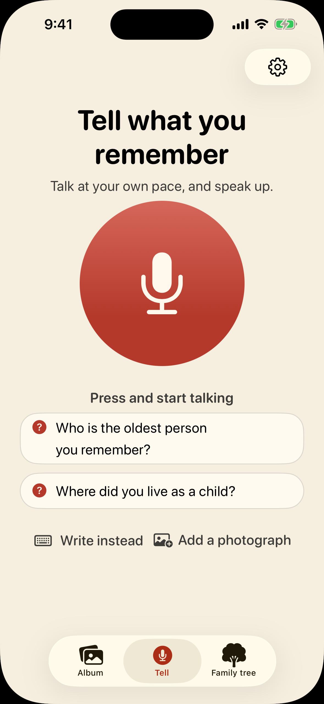
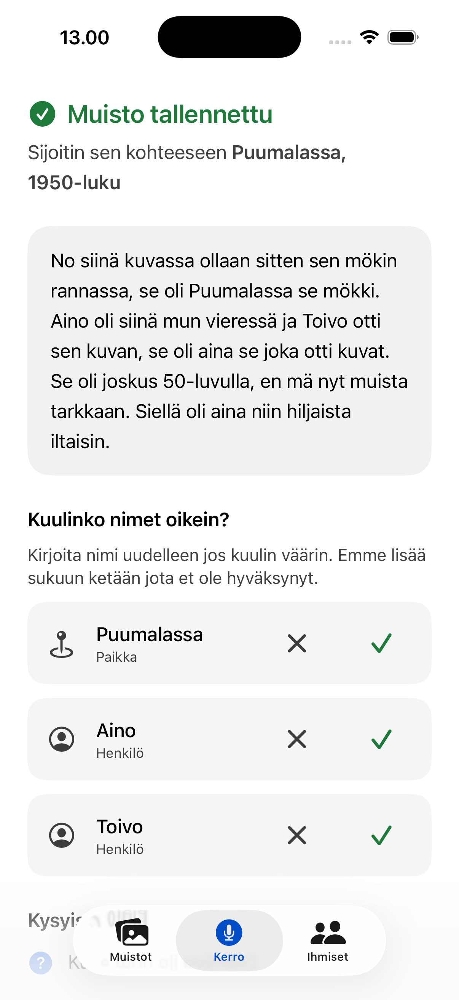
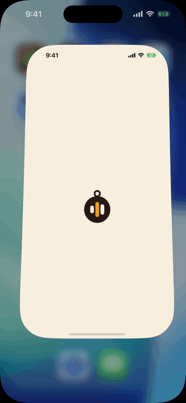
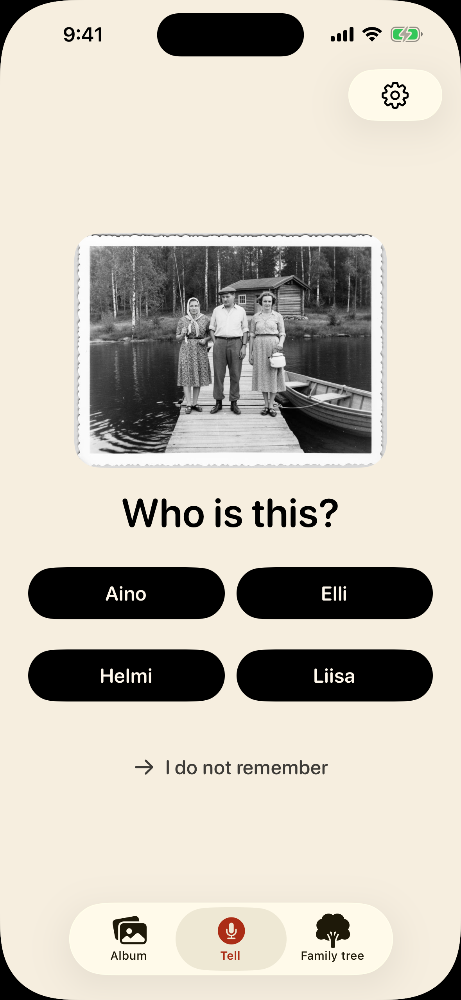
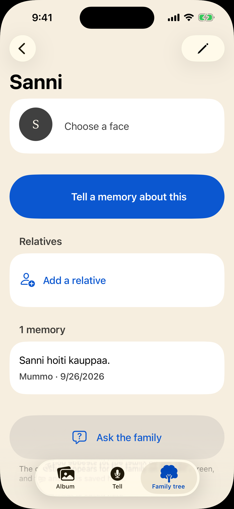
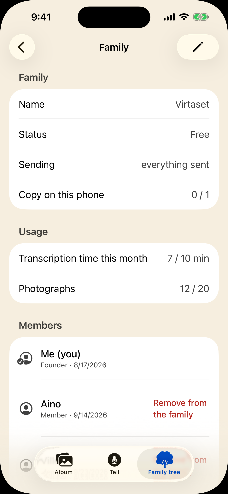
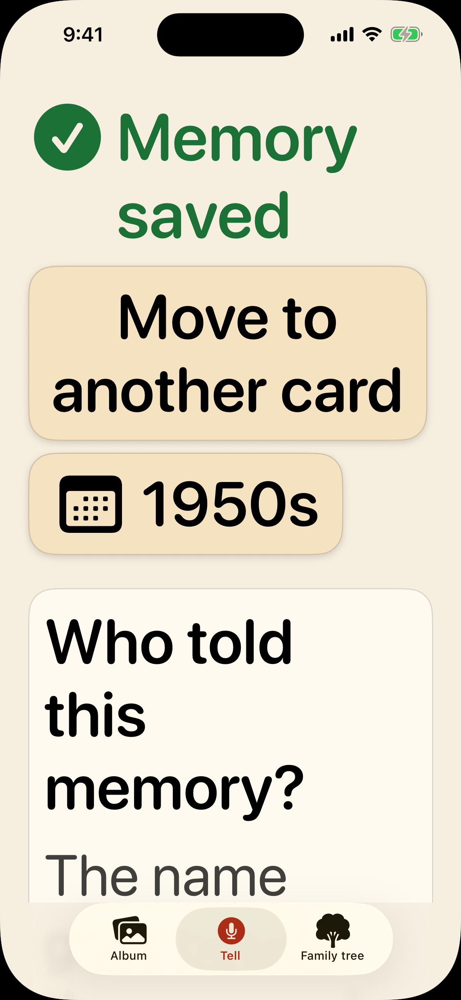

<p align="center">
  <picture>
    <source media="(prefers-color-scheme: dark)" srcset="docs/logo/lockup-dark.svg">
    
  </picture>
</p>

<p align="center">
  <a href="LICENSE"></a>
</p>

A family's shared memory archive. An old person rambles; the AI turns it into
structure: memories attach to photos and people, the family tree grows out of
the stories, and open questions come back to be asked.

The problem being solved: grandparents *know*, but cannot explain in a
structured way. They do not fill in forms and they do not tag photos — they
talk. Existing album and genealogy apps demand structured input from the one
person who will never produce it, and so the knowledge disappears at the funeral.

The 80-year-old in that paragraph is not a persona. It is my own grandparent,
who tested it — which is why the rules further down read as constraints rather
than good intentions, and why the failure that matters here is not a crash but a
story nobody could get told.

Side project for the [RevenueCat Shipaton 2026](https://revenuecat-shipaton-2026.devpost.com/)
hackathon. Target category: **Next Gen Award** (student category).

**Reading it as a judge:** this README, then
[`ARCHITECTURE.md`](docs/ARCHITECTURE.md) — §1 for what is built and what is
not, §6 for the money — then the code both of them name. The RevenueCat half is
mapped file by file under **Who pays**, and the app builds and runs on a
simulator with no keys and no Apple team (**Setting it up**, step 1).
[`CLAUDE.md`](CLAUDE.md) is not product documentation: it is the working
agreement of the AI coding sessions that did most of the typing, mostly about
several of them sharing one tree. Read it after the code, not before.

## The one thing it does

> Grandmother presses a big button and rambles for 90 seconds about an old
> photo. The app returns: the memory in her own voice and in readable words,
> attached to the photo; the names and places it heard, each with the
> sentence it was heard in, waiting for a person's yes; the time as she said
> it — and two questions back.

<p align="center">
  
</p>

<p align="center"><sub>Simulator, stub pipeline — the waiting is real, the model call is canned.<br>Reproduce it, and every picture on this page, with <code>scripts/readme-shots.sh</code>.</sub></p>

```
audio → ASR (Finnish) → raw_transcript (kept verbatim)
                             ↓
                     LLM extraction (structured output)
                             ↓
     ┌───────────────────────┼───────────────────────┐
memory.body           mentioned subjects      follow-up questions
(cleaned text)        (confirmed = 0)         (prompt_question)
```

|  |  |
|---|---|
| **Telling.** One button, and a way out of it for anyone who would rather type. | **What comes back.** The date is a decade because that is what was said, and no name enters the family tree before somebody confirms it. |

Everything else in the app exists to make that loop worth repeating. What is
built and what is not is inventoried, honestly, in
[`ARCHITECTURE.md` §1](docs/ARCHITECTURE.md#1-where-things-stand) — including a
warning about why that inventory has been wrong before.

### And then it asks

The follow-up questions are not a list to read. The app speaks one, listens for
the answer, organises what it heard, and asks the next — round after round,
without a tap. That matters because the person it is for should not have to
operate anything while she is remembering:

<p align="center">
  
</p>

<p align="center"><sub>Two rounds, hands-free. The timer counts real seconds, not a cut.<br>Reproduce it with <code>scripts/readme-shots.sh</code>, which runs <code>-screen interview</code>.</sub></p>

How the questions are chosen, and why they get more personal only as the
answers earn it, is the question ladder in
[`ARCHITECTURE.md` §12](docs/ARCHITECTURE.md#12-the-question-ladder).

The voice asking is the phone's own speech synthesiser, reading the question on
the device (`InterviewVoice.swift`). It is the only voice the app makes: the
teller's is kept as it was recorded (rule 3) and never synthesised.

## Six rules that do not bend

1. **The primary user is 80 years old.** Dynamic Type up to XXL, VoiceOver,
   large tap targets. If a new screen does not work at the largest text size, it
   is not done. Colours come from `Elder.swift`, never from `.secondary` or the
   system blue — every one of those measures below the contrast minimum, and
   contrast is the one rule eyes cannot check.
2. **Telling is never paywalled.** The paywall limits photos, AI minutes and
   colourisations, not the act of writing or dictating a memory.
3. **The original audio and the raw transcript are always kept.** The speaker
   may no longer be around to ask. `memory.audio_r2_key` and
   `memory.raw_transcript` are not intermediate steps; they are the product.
4. **AI proposes, a human confirms.** A person or relationship inferred by the
   model is created with `confirmed = 0` and never appears in the family tree as
   fact. A wrong relationship is worse than a missing one.

   The strongest confirmation is a blind one. When a name was heard in a
   telling about a photograph, the app later shows that photograph and asks
   *Who is this?* over three or four of the family's names, the proposal
   unmarked among them — so choosing it is recognising the person, not agreeing
   with a name already on the screen. Any other answer (another name, or *I do
   not remember*) confirms nothing and is never called wrong: the app does not
   know who is in the picture either. Nothing on that screen names the
   proposal, not even the photograph's VoiceOver label, and
   `BlindConfirmationTests` checks every text, button and image on it
   ([`ARCHITECTURE.md` §23](docs/ARCHITECTURE.md#the-blind-confirmation-built-30-aug-2026)).

   <p align="center"></p>
   <p align="center"><sub>Simulator, <code>-seed blind</code> — the photograph is the fixture's drawn stand-in.<br>One of the four names is the proposal, and nothing on the screen says which.</sub></p>

5. **Uncertainty is stored, not rounded.** "Sometime in the fifties" goes into
   `date_start`/`date_end` with precision `decade`. No date is forced.
6. **No login screen.** Identity is a UUID in the Keychain; you join a family
   through an invite link.

## The core of the data model

A single `subject` table covers photos, people, places and events; a `memory`
attaches to any subject. That is why *"write a memory about this photo"* and
*"tell us what grandmother was like"* are the same screen and the same code
path, and why the family tree is just the edges between person subjects.
Schema: [`backend/schema.sql`](backend/schema.sql).

|  |  |
|---|---|
| A person card is the same screen as a photo, because a person is the same row. The empty **Relatives** section is the point: a gap is an invitation, not an error. | One archive, several members, one shared quota. The quota belongs to the family rather than to whoever paid for it — see **Who pays**. |

## How to check any of this yourself

Several parts of this app fail *silently* — they keep working, look right, and
are wrong. Each one has a check of its own rather than a promise:

```bash
./scripts/verify.sh
```

That runs everything below that costs nothing and says what it skipped and why.
What it deliberately leaves out is argued in its header: nothing that spends
model credit, because a script you run twenty times a day must not cost money.

CI runs that same script rather than a reimplementation of it, so the two cannot
drift apart — but on pull requests and on request, not on every push. The Swift
checks in it need macOS, a macOS minute is metered at ten while this repository
is private, and every push getting one is how you find out in four seconds that
the meter said no. Every push still gets the backend type check, on Linux.

| Claim | Command |
|---|---|
| Every screen works at XXL text, with VoiceOver, at sufficient contrast | `xcodebuild … test` — 326 UI tests, 108 of them an accessibility sweep at both text sizes |
| One purchase unlocks one family, and never a second | `node scripts/entitlement-binding-check.mjs` |
| The paid archive is offered after a telling on a rhythm, never beside a name a human is being asked to confirm, never on a grandparent's phone and never where there is nothing to buy — while the purchase beside a ceiling the family has hit stands on every phone with a store | `swiftc … scripts/upsell-rhythm-check.swift` |
| A place's looked-up coordinates follow its title through sync, a point somebody placed stays where they put it, and rubbish is refused | `node scripts/place-sync-check.mjs` |
| Extraction gets Finnish names, dates and relations out of a transcript | `node scripts/extract-tests.mjs` |
| The whole pipeline runs end to end | `scripts/smoke-pipeline.sh` |

The last three need a Worker running (`cd backend && npm run dev`), and the last
two an OpenRouter key in it as well — they spend model credit, which is why
`verify.sh` leaves them out. The first three need only Xcode and node. The full
commands, with the arguments this machine forces, are in
[`CLAUDE.md`](CLAUDE.md#commands).

## Measured, not claimed

**The ASR engine was chosen by measurement**, not from memory:
`scripts/asr-bench.mjs` over 3 Finnish texts × 4 degradation steps × 5 models,
on 31 Jul 2026 — and run again on 30 Aug with an English set of the same shape
beside it. The second run's numbers sit in
[`backend/wrangler.jsonc`](backend/wrangler.jsonc) beside the setting they
justify.

**Two of them are bad, and they are printed here on purpose.** The chosen model,
`gemini-3.6-flash`, scores 65 % on Finnish proper nouns against the bench's own
tripwire of 80 %, and a word error rate of 37.3 % against its own *"above 30 %
is not usable"* — on synthesised speech, which is kinder than a real 80-year-old
voice. The run that chose it read 68 % and 37.8 %, so both runs missed both
bars. English, in the second run, reads 60 % on names and a word error rate of
29.9 %: below the name bar too, and a tenth of a point inside the other.

The concept was not dropped anyway, and
[PLAN.md §8](docs/PLAN.md#risk-2-honestly) argues why in full: the original audio
is kept forever and is playable, the raw transcript is kept beside the cleaned
text, and names are checked by the teller in the seconds after telling — or
corrected from the person's card years later. *One proper noun in three being
wrong is the premise the name-correction step was written for, not a surprise.*

**Accessibility:** 0 failures across 17 audits, measured 15 Aug 2026 on a
private simulator — every sweep there was that day, and the last whole-suite
run on record with no red in it. The suite has grown to the count in the table
above, and the last full run written down, at `a4fdf0f` on a quiet machine on
19 Sep, left four sweeps red with one finding each. The header of
`AccessibilitySweepTests.swift` keeps the tests that go red in company and green
alone, rather than explaining them away. (On a simulator shared with another
session, the 15 Aug commit reported 15 failures that were not real — see
`CLAUDE.md`.)

But the number is not the argument. This is one screen at the default text size
and at the largest one iOS offers, which is the size rule 1 is actually about:

|  |  |
|---|---|
| Default | Accessibility XXXL |

Nothing is clipped and nothing is truncated — the screen gets longer instead.
That is rule 1 in one pair. It is also why the sweep opens each screen and audits
it at both sizes rather than trusting a screenshot at one: a screenshot shows the
top of a screen, and clipping happens further down.

An audit shares that limit on a screen taller than the phone: it judges only
what the accessibility tree holds, and a list builds only the rows near the
screen. So the two setup forms, Perhe and all three states of Settings are
audited page by page at the largest size, and Help (*Näin tämä toimii*) and the
album by decade are still judged there only as far as the first screen reaches.
The comparison that found it sits behind `KINLORE_XXXL_LOSS` in
`AccessibilitySweepTests.swift`.

## What I got wrong

This is the first project where I wrote my mistakes down instead of quietly
fixing them. Five that cost real time, kept here because a repo that lists only
what worked is not telling you how it was built:

**I wrote things down as done before they were.** Nearly every row of
`ARCHITECTURE.md` §1 was marked finished while it was not, and every one of them
*looked* finished: the transcription that waited for a text nothing was
bringing, the deletion the client never sent, the rate limit that existed only
in the document, the accessibility audit that measured the wrong screen and
passed. They were found by reading a promise and then checking the code meant to
keep it — never by using the app, which behaved perfectly in all four cases.
That is this project's failure mode, and it is why the checks in the table above
exist as scripts and not as intentions.

**I set a tripwire and then walked past it.** The plan called Finnish ASR risk
#1 and told me to settle it *before any app code*. I measured five engines
properly — and then never ran the actual go/no-go on real elderly speech, which
is the half that decides anything. What I do have says 65 % on Finnish proper
nouns against my own 80 % bar. The concept survives because of how the app is
built, not because the number is good; the argument is in
[PLAN.md §8](docs/PLAN.md#risk-2-honestly) and it is the part I would most like
a judge to read.

**I corrected a fact in the wrong direction, confidently.** `CLAUDE.md` used to
state which Xcode was installed here. It was wrong, I "fixed" it — backwards —
and wrote the new wrong version with more certainty than the old one. Following
it fails as *"Invalid runtime"*, which reads like a broken Xcode and is not one.
The file now says: measure before editing this line, and paste the output rather
than a remembered number.

**I carried five candidate names for a year without checking any of them.** Two
were already taken outright, by apps doing this same thing. Checking costs one
HTTP request. Worse, the check I eventually wrote has two blind spots that both
bit me: reserved-but-unshipped names are invisible, and the API only sees the
App Store — *Saga* looked free while Saga plc sells insurance and cruises to 2.7
million over-50s in the UK, which is the same demographic as this app.

**I chased a red test run for an evening.** Fifteen accessibility failures,
contrast and clipping, on a screen that passes on its own. Another session was
using the same simulator. Measured afterwards: 15 failures shared, 0 of 17
private, same commit, minutes apart. The tests were not lying about the screen;
they were lying about which process they had hold of.

## Who pays

**The payer is not the beneficiary.** Grandmother does not buy a subscription —
the grandchild does, and the whole family channel opens for every member.
RevenueCat grants the entitlement to the buyer; the backend maps it to a
channel-level right (`family.entitlement`). For an audience whose ability to pay
sits in a different person than the one producing the value, that is the only
model that works. Details: [`ARCHITECTURE.md` §6](docs/ARCHITECTURE.md#6-money).

Purchases run on the **RevenueCat Test Store** — there is no App Store release,
by decision ([PLAN.md §2](docs/PLAN.md)).

**What the free tier limits** is three meters, counted on the server because a
counter on the phone can be edited (`backend/src/quota.ts`): ten minutes of
transcription a month, twenty photographs in all and five colourisations a month
(`backend/wrangler.jsonc`). Writing a memory is none of them (rule 2), and a
recording over the limit is kept with its transcription deferred, not refused
(rule 3).

**How a purchase becomes the family's** is four pieces, all in
[`backend/src/entitlement.ts`](backend/src/entitlement.ts) and routed in
`backend/src/worker.ts`, each with a check that needs no key, no Worker and no
network:

| Piece | What it does | Check |
|---|---|---|
| `POST /entitlement/sync` | The phone says *this customer bought something* and sends only the customer id. The Worker asks RevenueCat's REST API what that customer actually owns and writes the family's right from the answer, so editing the app unlocks nothing. | `scripts/entitlement-sync-check.mjs` |
| `POST /webhook/revenuecat` | RevenueCat's subscription events, authenticated by a shared secret. Only an expiry, a transfer and a refund take the tier away: turning auto-renew off keeps the month somebody paid for. | `scripts/webhook-revocation-check.mjs` |
| Reconcile | A stored paid tier whose date has passed is the one state that cannot be true, so RevenueCat is asked again. If it cannot be reached, the family keeps what it had. | `scripts/entitlement-reconcile-check.mjs` |
| One purchase, one family | A unique index on `member.rc_app_user_id` in `backend/schema.sql`: the same customer cannot unlock a second family, and a restore inside the family moves the binding. | `scripts/entitlement-binding-check.mjs` |

Each check loads the real `schema.sql` into an in-memory SQLite, the first three
drive the real functions with RevenueCat's side stood in for, and
`./scripts/verify.sh` runs all four.

On the phone the SDK is configured in
[`RevenueCatPurchases.swift`](ios/Kinlore/Services/RevenueCatPurchases.swift),
the paywall is RevenueCatUI's own view (`PaywallSheet.swift`) — its design and
products are configured remotely in RevenueCat's dashboard, not in this code —
and a purchase reaches the Worker through `EntitlementClient` in
`PurchaseService.swift`. When the paywall is offered is `UpsellRhythm.swift`,
checked by its row in the table further up.

**A clone has no paywall to open.** It appears only with a RevenueCat key, and
none is in the repository: a Test Store key in a public clone would hand the
paid tier on the production Worker to anybody, and its model bill with it. The
paywall and a Test Store purchase are in the demo video. To see them yourself,
run the `Kinlore` scheme with a Test Store key of your own (**Setting it up**,
step 3) against a Worker that has `RC_SECRET_KEY` — without it
`/entitlement/sync` answers `503`, because it will not take the phone's word. A
DEBUG build with `-seed` and no backend address skips the server and opens the
archive by itself (`Session.syncPurchase`), which is how the film's take is
made.

## The cloud question, unanswered in public

Who hands a dead parent's voice to somebody's server? What is true today, rather
than what is comfortable.

**What the server keeps and cannot read.** Since 24 Aug 2026 the memory bodies,
the raw transcripts, the subject titles, the question text and the bytes in R2 —
the photographs and the voices — are sealed on the phone before they sync. The key
never reaches the Worker; between people it crosses only inside the invite text.
`scripts/lever3-roundtrip-check.swift` puts two identities through a real
deployment and checks both halves: that what lands in D1 and R2 is sealed, and
that the second phone opens it byte for byte.

**What it can still read** is the more useful half, and
[`ARCHITECTURE.md` §18](docs/ARCHITECTURE.md#18-places-on-a-map--the-three-columns-and-what-they-cannot-promise)
lists it exhaustively rather than in outline: the family's own name and its
members' display names, timestamps, the dates with their precision, audio
lengths, relationships, the graph of which memory names which subject, and the
coordinates of places, with who placed a point by hand and when. That last one
is a decided leak and not an oversight — for a family's most-told places a
coordinate is the name in different clothes — and the argument for keeping it
in v1 is written down beside it.

**What passes through it in the clear is another list.** The recording goes to
the Worker unsealed, and the Worker hands it to a model provider through
OpenRouter to be written down — a model cannot transcribe speech it cannot
hear. The transcript then goes the same way to be structured, with the title,
date and place of the subject it is filed under, the names already linked to
it, the questions still open on it and, for a telling about a photograph, the
photograph (`ExtractionContext.swift`). A photograph leaves once more when
somebody asks for its colours, with the memories told about it, and that button
says so before anything is sent. Every one of those requests carries
`provider: { data_collection: "deny" }`, the flag that keeps the words out of a
training set (rule 8, checked without sending anything by
`scripts/data-collection-check.mjs`), and the Worker writes none of it down:
transcription and colouring keep only their meters, extraction keeps nothing,
and R2 receives only what `/media` is handed, which is sealed. So "cannot read"
is a claim about what is *kept*.
End-to-end in the strict sense — a server that never holds the plaintext at
all — is incompatible with server-side transcription, and sealing at rest does
not close that hole.

**What the user is told, and when.** Since 16 Aug 2026 the create and join forms
say before their button that the recording is sent to be written down and that
the original is kept (`WhereMemoriesGo`; `ConsentOrderTests` checks at both
text sizes that it is on screen whenever the button is), and the create form
offers *"Vain minulle, tälle puhelimelle"*: an archive kept to one phone, which
sends no recording and transcribes nothing (the guard in
`TellViewModel.stopAndProcess`). `LocalModeTests` pins what that mode says and
not the guard itself, and its header says why. Since 26 Sep 2026 the notice,
the Help screen and the microphone prompt say that the recording goes through
OpenRouter to a model, and the notice and Help add the photograph that has
travelled with a telling about one since 19 Sep 2026
([`ARCHITECTURE.md` §12](docs/ARCHITECTURE.md#12-the-question-ladder)). They
promise one thing about it, the one the flag enforces: none of it trains a
model. What a provider keeps is that provider's policy, and the app does not
state it on anybody's behalf.
The notice, the mode and the sealing are three of the four levers priced in the
last item of [PLAN.md §10](docs/PLAN.md).

**And there is a second credential: an Apple account.** `family_key` carries
`kSecAttrSynchronizable`, so it reaches every device signed into the same Apple
ID. The resilience and the way in are one mechanism, and
[`ARCHITECTURE.md` §4](docs/ARCHITECTURE.md#4-identity-and-family) says so
instead of presenting only the half that flatters.

What the repo does guarantee: `OPENROUTER_API_KEY` exists only as a Worker
secret, `provider: { data_collection: "deny" }` is unconditional and never a
per-call flag, and an upstream error's own words reach neither the client nor
the log. The app gets `{ error: "upstream_failed" }`. The Worker's log gets the
HTTP status and the provider's own error code, and never an upstream body:
those can echo back the memory that was just told, and Workers Logs is a store
the family can neither export nor clear.

## Layout

| Directory | Contents |
|-----------|----------|
| `ios/` | SwiftUI app. The project is generated from `project.yml` with XcodeGen. |
| `backend/` | Cloudflare Worker + D1 (metadata) + R2 (photos and audio). |
| `scripts/` | The checks in the table above, plus `asr-bench.mjs` and the logo tooling. |
| `docs/` | `PLAN.md` (scope, schedule, risks), `ARCHITECTURE.md`, `SETUP.md`, `logo/`. |
| `.claude/` | The [guideline file](.claude/skills/karpathy-guidelines/SKILL.md) Claude Code works under here — vendored, MIT, [why](CLAUDE.md#the-assistants-rules--checked-in-not-personal-setup). |

## Setting it up

**Prerequisites:** Xcode 26.6 (iOS 26.5 simulator SDK), XcodeGen
(`brew install xcodegen`), Node 22.18+. **Nothing from Apple beyond Xcode** — no
paid developer account, no certificates, no Sign in with Apple. The two push
notifications are the one exception, and nothing waits on them. What else is not
needed, and why, is in [`SETUP.md`](docs/SETUP.md#what-is-not-needed).

### 1. The app on its own — no keys, no backend, about two minutes

```bash
git clone https://github.com/sunnyflower123/Kinlore.git
cd Kinlore/ios && xcodegen generate && open Kinlore.xcodeproj
```

Pick an iPhone simulator and press Run. The `Kinlore` scheme builds Debug, and
a simulator build needs no signing team — `ios/Signing.xcconfig` names none. A
phone does need one of your own, and
[`SETUP.md`](docs/SETUP.md#ios-app--signing-for-a-real-device) has the one file
it goes in. **The app is fully usable on stubs**: record or type a memory,
watch it come back structured, browse the people it proposed. That is
deliberate rather than a demo mode — development must not stop when the Worker
is broken or there is no network — and it means anyone can try this without an
account of any kind. The paywall is the one thing missing, because it needs a
RevenueCat key; **Who pays** says why none is included.

Run `xcodegen generate` again after changing `project.yml` **and after adding or
removing a source file** — XcodeGen globs the sources, so a new `.swift` file is
invisible to `xcodebuild` until it runs.

### 2. The backend, locally

```bash
cd backend && npm install
printf 'OPENROUTER_API_KEY=sk-or-...\n' > .dev.vars
npm run db:local   # FIRST TIME ONLY — this creates the tables, it does not migrate them
npm run dev
```

`.dev.vars` is gitignored — **check anyway before your first push**, because the
repo is public. One key covers both halves of the pipeline: OpenRouter has no
separate transcriptions endpoint, so audio travels as an `input_audio` part of a
chat completion. That key lives only in the Worker, never in the app; unpacking
an IPA is trivial and a leaked key is a real bill.

```bash
curl -s http://localhost:8787/health
```

`{"ok":true,"hasKey":true}` means the key is in place. If `hasKey` is `false`,
extraction answers `502 upstream_failed`, and the Worker's log records the
status, 401, and nothing more.

### 3. Point the app at it

In Xcode: Product → Scheme → Edit Scheme → Run → Arguments.

| Argument | Effect |
|---|---|
| `-api http://localhost:8787` | Real transcription and extraction instead of stubs |
| `-rcKey <RevenueCat Test Store key>` | Purchases, **in a Debug build only**. Without it the app works normally, minus the paywall |

**A Test Store key stops a Release build, by RevenueCat's design.** The app
compiles no key in: it reads `rcKey` from `UserDefaults` at launch, the same way
in every configuration (`RevenueCatPurchases.swift`), and with none it never
configures RevenueCat — no paywall, no crash. With a `test_` key, the SDK in a
build without the `DEBUG` flag shows an alert and then calls `fatalError`
(`checkForSimulatedStoreAPIKeyInRelease` in purchases-ios's
`Configuration.swift`; [RevenueCat's note](https://rev.cat/sdk-test-store)).
The `Kinlore` scheme runs Debug, so the argument is safe there. `Kinlore
Production` and an archive build Release: give them neither the argument nor a
`defaults write com.kinlore.app rcKey …` left on a simulator.

Both arguments are optional, and there are about twenty more. The debug ones
exist because some states cannot be reached by hand at all — a refused
microphone, a family with no server behind it, an extraction that fails while
transcription succeeds.
They are what the UI tests and the demo video are filmed with, and they are
listed in [`SETUP.md`](docs/SETUP.md#launch-arguments).

### 4. Your own Cloudflare resources — only for the cloud half

```bash
cd backend && npx wrangler login
npx wrangler d1 create memorize && npx wrangler r2 bucket create memorize-media
```

Put the returned `database_id` in [`backend/wrangler.jsonc`](backend/wrangler.jsonc),
and your own RevenueCat project's id in `RC_PROJECT_ID` beside it, push the
schema to the remote database with `npm run db:remote`, then add the three
secrets ([what each is for](docs/SETUP.md#backend--as-worker-secrets)):

```bash
npx wrangler secret put OPENROUTER_API_KEY   # and RC_SECRET_KEY, RC_WEBHOOK_SECRET
```

In RevenueCat, point a webhook at `/webhook/revenuecat` on your Worker with an
Authorization header of exactly the value you gave `RC_WEBHOOK_SECRET` — the
Worker compares the two and answers `401` to anything else.

The Cloudflare resources keep the old project name `memorize` on purpose: an R2
bucket cannot be renamed, only recreated empty, and rule 3 lives in that bucket.

Two months of development cost under €20 in total — the estimate, item by item,
is at the end of [`SETUP.md`](docs/SETUP.md#cost-estimate-during-development).

## Building and testing from the command line

This needs two things the machine forces. `DEVELOPER_DIR`
is mandatory because `xcode-select` points at CommandLineTools and changing it
would need `sudo`. And the simulator has to be given **by UDID**: four devices
here are called *iPhone 17 Pro*, so a `name=` destination fails as *"Unable to
find a device matching the provided destination specifier"*, which reads like a
missing simulator and is not one.

```bash
SIM=$(DEVELOPER_DIR=/Applications/Xcode.app/Contents/Developer xcrun simctl list devices available | grep -m1 'iPhone 17 Pro (' | grep -oE '[0-9A-F]{8}-([0-9A-F]{4}-){3}[0-9A-F]{12}')
```

```bash
DEVELOPER_DIR=/Applications/Xcode.app/Contents/Developer xcodebuild -project ios/Kinlore.xcodeproj -scheme Kinlore -sdk iphonesimulator -destination "id=$SIM" build
```

The UI tests need a simulator of their **own** — they install, launch and
terminate one bundle id, and two runs on one device kill each other's process
and report accessibility failures that are not real. Create one, then pass its
id as `$KINLORE_TEST_SIM`:

```bash
xcrun simctl create kinlore-tests com.apple.CoreSimulator.SimDeviceType.iPhone-17-Pro com.apple.CoreSimulator.SimRuntime.iOS-26-5
```

## Two languages, on purpose

The repo is written in **English**: docs, comments, identifiers, commit
messages. The app's user interface is **written in Finnish**, because the person
it exists for is a Finnish 80-year-old — and it **speaks English by default**,
because the app has to be shown to people who do not read Finnish. A Finnish
phone still gets Finnish. The Finnish source strings are the lookup keys, so
writing a new one still means writing Finnish; `scripts/localisation-check.mjs`
fails if it has no English.

The pipeline follows **who is speaking**, not who is reading the screen: there
are two system prompts and two hallucination ceilings, and the app says which
applies. The English prompt is not the Finnish one translated — its first rule
teaches a model about case endings that English does not have. The test
transcripts stay Finnish because they are the input under test. The boundary and
its exceptions are spelled out in [CLAUDE.md](CLAUDE.md).

## Licence

[Apache 2.0](LICENSE).
