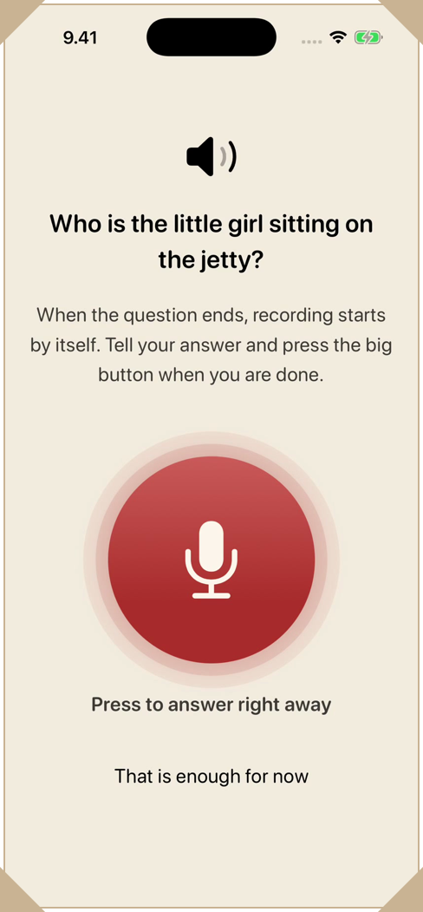
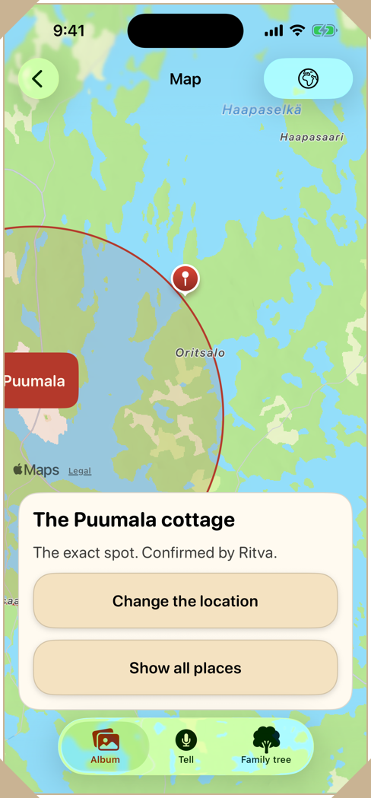
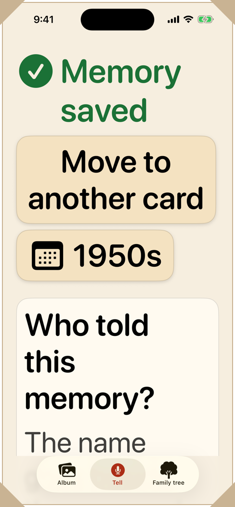
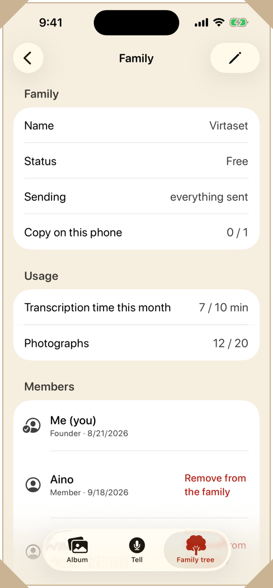
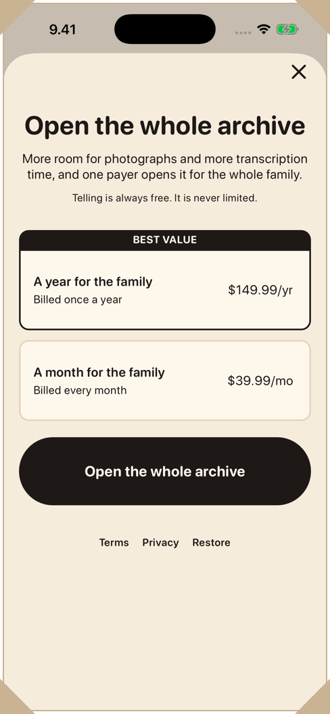
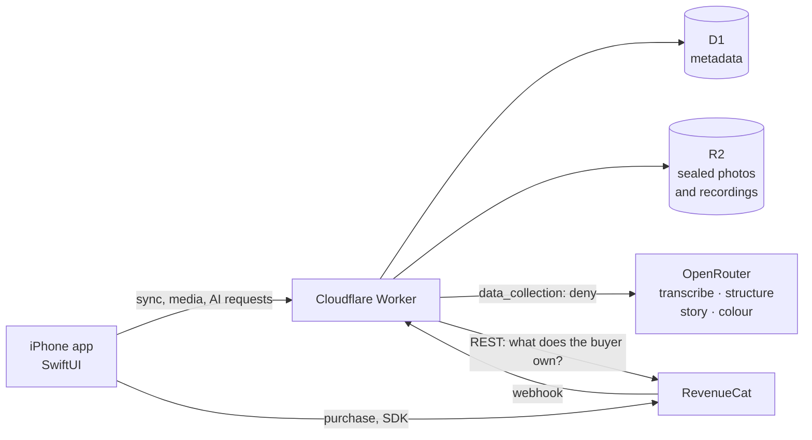

<p align="center">
  <picture>
    <source media="(prefers-color-scheme: dark)" srcset="docs/logo/title-plate-dark.svg">
    
  </picture>
</p>

<p align="center">
  <a href="LICENSE"></a>
</p>

Kinlore is a family's shared memory archive for iPhone. Anyone in the family
tells what they remember about an old photo, and the AI gives it structure.
I built it for the
[RevenueCat Shipaton 2026](https://revenuecat-shipaton-2026.devpost.com/)
hackathon, in the Next Gen Award (the student category).

## The short version

- **Tell, and it asks back.** Press one button and talk about an old photo in
  English or Finnish, or type instead. Follow-up questions come out loud, and
  it listens to each answer.
- **AI proposes, a human confirms.** Names it heard wait for a yes before they
  enter the family tree. A blind check shows the photograph and asks *Who is
  this?* over three or four names, the proposal unmarked.
- **Measured, and built around what it misses.** On the bench's synthetic
  Finnish speech, the shipped model writes 89 % of proper nouns exactly right
  when the speech is clean, 72 % with room noise, and 28 % when the voice is
  also quiet and muffled, where it writes a fluent wrong story instead
  ([measured 1 Oct 2026](docs/DETAILS.md#measured-not-claimed)). So the
  recording is always kept, every name waits for a person, and any name can be
  corrected later.
- **Vague dates stay vague, and nothing is thrown away.** "Sometime in the
  fifties" is stored as a decade, and the original recording and the raw
  transcript are always kept.
- **The whole family.** Everyone joins on their own phone through an invite
  link, with no login. Paper photos are photographed straight in and can be
  coloured from what the family told about them.
- **Who it is for.** Whoever wants to tell, often an older person. My
  grandparent tested it; their question, "How do I know it's saved?", is why
  the screen now says *Your voice is kept on this phone* while it waits.
- **Who pays.** Often not the one who tells: one member subscribes, $39.99 a
  month or $149.99 a year, and the backend grants it to the whole family,
  checked with RevenueCat's REST API and webhook.
- **Free tier.** Ten minutes of transcription a month, twenty photographs in
  all and five colourisations a month. Telling itself is never limited: a
  recording over the limit is kept and waits for its text.
- **The paywall** is RevenueCatUI's own view. The result screen offers it after
  every third telling, but never when that telling proposed names to confirm or
  on a phone with *Larger text* on, a grandparent's.
- **What it costs.** A typical paying family (5 tellers × 20 minutes, 20
  colourisations, 50 photographs) costs about $4.05 a month, which leaves 88 %
  of what a US sale of the monthly plan brings in.
- **Try it.** `./scripts/try-it.sh` needs no keys and really hears you ([the
  steps](#try-it)); `--example` opens an invented family with a tree and a
  blind card. Only the paywall (`--paywall`) needs the Test Store key from
  the submission.
- **Built with** SwiftUI · RevenueCat's SDK and RevenueCatUI · Cloudflare
  Workers + D1 + R2 · OpenRouter, called only from the Worker.
- **Privacy.** The phone seals memories, transcripts, photos and recordings
  before sync, with a key the Worker never gets. It is not end-to-end: a model
  gets them unsealed to transcribe, structure or colour.
- **Tested.** 406 UI tests, including 127 accessibility sweeps at the default
  and the largest text size, where body text is about three times its default
  size. `./scripts/verify.sh` holds 64 checks that spend no API credit.
- **Known limits:** a paying family has no AI ceiling or rate limit yet, so a
  heavy one costs more than either plan brings in
  ([costs](#what-a-family-costs-to-run)), and the purchase check trusts the
  customer id the app sends ([known
  issues](docs/ARCHITECTURE.md#1-where-things-stand)).

<p align="center"><a href="https://youtu.be/O51CfTi8l7w"><b>▶ Watch the demo video (2 min)</b></a><br>
Its app shots are simulator recordings of the real app: the transcripts, the follow-up question, the story and the colours come from its real AI pipeline, and its voices and photographs are synthetic.</p>

<p align="center">
  
</p>

<p align="center"><sub>Simulator, stub pipeline: the telling and the model call are canned.</sub></p>

| <a href="docs/media/01-tell.png"></a> | <a href="docs/media/02-result.png"></a> | <a href="docs/media/03-who-is-this.png"></a> |
|---|---|---|
| **Telling.** One button, a way to type instead, and two questions to start from. | **What comes back.** The two names it heard wait for a cross or a tick, each with the sentence it was heard in. | **Who is in this photo?** The card asks it of a generated photograph over four names, nothing says which is the proposal, and *I do not remember* is offered too. |
| <a href="docs/media/10-asks-back.png"></a> | <a href="docs/media/11-story.png"></a> | <a href="docs/media/12-colours.png"></a> |
| **It asks back.** The question the model asked after a telling about the jetty photograph, read aloud. When it ends, the app listens by itself. | **The story.** The model put three memories of one photograph into one story. The family can edit it, and the memories stay below it. | **Colours by the telling.** The model's colours for a generated photograph, guessed from what was told and kept only if someone confirms. |
| <a href="docs/media/07-album.png"></a> | <a href="docs/media/13-map.png"></a> | <a href="docs/media/08-family-tree.png"></a> |
| **Album.** The family's photographs by decade, every one of them generated. | **Map.** The example family's places. The cottage is an exact spot, a pin with who confirmed it, and the town of Puumala is a circle. | **Family tree.** The invented example family from `--example`, drawn around the phone's owner. |
| <a href="docs/media/06-result-xxxl.png"></a> | <a href="docs/media/05-family.png"></a> | <a href="docs/media/09-paywall.png"></a> |
| **The largest text size.** The result screen grows longer instead of cutting words off. | **The family.** Its members, and its use of the free tier: 7 of 10 minutes this month and 12 of 20 photographs. | **Paywall.** RevenueCatUI's own view: $149.99 a year or $39.99 a month for the whole family, and telling is always free. |

<p align="center"><sub><i>It asks back</i>, <i>The story</i> and <i>Colours by the telling</i> are frames from the demo video's simulator recordings: the question, the story and the colours in them came from the real AI pipeline.</sub></p>

<p align="center">
  <picture>
    <source media="(prefers-color-scheme: dark)" srcset="docs/logo/divider-dark.svg">
    
  </picture>
</p>

## The full version

Everything below is the detail: what each part does, how it is built and
tested, how to run it, how the paywall is wired, what it costs to run and how
the data is protected; the longest version is
[docs/DETAILS.md](docs/DETAILS.md).

Album and genealogy apps ask for structured input: a form to fill in, a face to
tag, a date to pick. A family's memory is not kept that way. It is told, a
little at a time and by different people, and whatever nobody wrote down goes
when they do. Kinlore keeps the telling and does the sorting itself. Everyone
tells into the same archive from their own phone, and the app is built for
whoever wants to tell, often an older person.

My own grandparent tested it, which is why
[the ten rules that do not bend](CLAUDE.md#rules-that-do-not-bend) read as
constraints rather than good intentions; the rule numbers on this page refer to
them. The failure that matters here is not a crash but a story that never got
told. So the app is quiet on purpose: no streaks and no numbers on the tabs,
because a number on a tab is a debt, and the person the app waits for is often
the oldest in the family.

## What it does

- **One button.** You press it and talk about an old photo. The memory is kept
  in your own voice and in readable words, attached to the photo.
- **Proposals, not facts.** The names and places it heard come back as
  proposals, each with the sentence it was heard in. None of them enters the
  family tree until a person says yes (rule 4).
- **Questions out loud.** It asks follow-up questions, listens to each answer
  and asks the next one, round after round, without a tap.
- **Who is in this photo?** Later it shows the photograph a name was heard
  in and asks who is in it, over three or four of the family's names with the
  proposal unmarked among them. Any other answer confirms nothing and is never
  called wrong
  ([ARCHITECTURE §23](docs/ARCHITECTURE.md#the-blind-confirmation-built-30-aug-2026)).
- **One story per card.** The AI puts what the family told about a card into
  one story at the top of it. The model is told to keep to the tellers' own
  words and add nothing; the Worker checks only that a story came back, and
  every telling stays under it as it was told
  ([ARCHITECTURE §27](docs/ARCHITECTURE.md#27-the-story-on-a-card)).
- **Nothing rounded, nothing thrown away.** The original recording and the raw
  transcript are always kept (rule 3). A date stays as vague as it was said, so
  "sometime in the fifties" is stored as a decade (rule 5).
- **Two languages.** English by default, Finnish on a phone set to Finnish, and
  speech is heard as that language. Settings can choose either.
- **Settings** has larger text, which also makes the app simpler, and exports
  the whole archive as one file: the memories as a readable page, the original
  recordings and the photos.

Every screen has to work at the largest text size and with VoiceOver (rule 1).

## At a glance

- **Built with** SwiftUI · Cloudflare Workers + D1 + R2 · OpenRouter · RevenueCat
- **RevenueCat** One member buys and the whole family gets the archive. The SDK
  and RevenueCatUI's paywall run on the phone; the Worker asks RevenueCat's REST
  API what the buyer owns, and the webhook keeps it current.
- **Tested** 406 UI tests, including 127 accessibility sweeps that audit a
  screen at the default text size and again at the largest.
  `./scripts/verify.sh` holds 64 checks that cost nothing and says which it
  skipped; CI runs the same script.



## Try it

You need a Mac with Xcode 26 or later (it is built here with Xcode 27.0 and
tested on an iOS 26.5 simulator) and XcodeGen (`brew install xcodegen`). You do
not need a paid developer account, certificates or any keys.

```bash
git clone https://github.com/sunnyflower123/Kinlore.git
cd Kinlore && ./scripts/try-it.sh
```

[`scripts/try-it.sh`](scripts/try-it.sh) builds the real app, the
`Kinlore Production` scheme against the deployed Worker, and opens it on a
simulator of its own called *Kinlore Try*. It installs nothing and leaves every
other simulator alone. The first build takes several minutes; a second run
rebuilds only what changed. Then:

1. **Start a family archive.** Type your name and press *Create the archive*.
   Skip *Keep the memories on this phone only* under it: that archive never
   reaches the server, so a recording is kept but never written out as text,
   and no names come back. The sheet that follows asks whose memories to keep;
   *Close* skips it.
2. **Tell it something.** The *Tell* tab opens on an example to read aloud:
   *"My grandmother Anna grew up in Helsinki. She married Walter sometime in
   the fifties, and he always had the camera."* Press the microphone and read
   it, or tell something of your own. The first time, iOS asks for the
   microphone, and the Mac may then ask as well. *Type it for me* puts it in
   the write field instead, and *Save* sends it.
3. **See what comes back.** A spoken telling is followed by questions asked out
   loud; answer them or press *That is enough for now*. The names it heard are
   proposals that nobody has confirmed yet (rule 4), and "sometime in the
   fifties" is kept as the 1950s rather than a guessed year (rule 5).

What you say is heard for real, within the free tier's ten minutes of
transcription a month.

**Two phones, one family.** `./scripts/try-it.sh --two` opens it on two
simulators. On the first, open Settings with the gear at the top right of
*Family tree*, then *Family members and invitations*, *Invite a family member*
and *Share the invitation*. On the
second: *Join with an invitation link*, paste the whole invitation and press
*Join a family*. A phone fetches the family's changes when Kinlore opens or
comes back to the front, so after adding something on the first, go to the
second simulator's home screen (⇧⌘H) and open Kinlore again.

**An archive a year or two in.** A first try cannot show what a family's archive
looks like later, so there is an example, and you choose to see it:
`./scripts/try-it.sh --example` opens it on *Kinlore Example*. **Everything in
the example is invented**: the Koivula family and its people, the 150 pictures,
which the app draws on the simulator in a few seconds the first time it opens,
and some 250 tellings. It is a Debug build on stubs with no server behind it,
so a telling there comes back as one of three sample tellings whatever you say,
and each run puts the example back as it was.

**From Xcode.** `cd ios && xcodegen generate && open Kinlore.xcodeproj`, choose
the **Kinlore Production** scheme and an iPhone simulator, and press Run. The
`Kinlore` scheme Xcode opens on runs on the stubs the tests need, which cannot
listen. The backend, the keys and the command-line test runs are in
[DETAILS.md](docs/DETAILS.md#setting-it-up) and [SETUP.md](docs/SETUP.md).

### See the paywall

The script's default build cannot show the paywall, because RevenueCat's SDK
stops a Release build that is given a Test Store key, the only kind of key
this project has. `--paywall` builds the Debug one instead, against the same
deployed Worker, on a simulator of its own called *Kinlore Paywall*:

```bash
./scripts/try-it.sh --paywall
```

It asks for the key without showing it (or reads `KINLORE_RC_KEY`) and writes
it nowhere but that simulator. The Test Store key is in the submission's
Additional info, for judges. A Test Store purchase is simulated and no money
moves; the script says where the offer is and what buying it opens for the
whole family.

## Who pays

One member pays, and the whole family gets the archive. Whoever tells is not
necessarily whoever pays, so RevenueCat grants the entitlement to the buyer and
the backend maps it to a right for the whole family (`family.entitlement`).
Purchases run on the RevenueCat Test Store, since there is no App Store release.

- **The free tier** limits three things, counted on the server: ten minutes of
  transcription a month, twenty photographs in all and five colourisations a
  month. Telling is never paywalled (rule 2): a recording over the limit is
  kept, and its transcription waits.
- **The paywall** is RevenueCatUI's own view, designed and priced remotely in
  RevenueCat's dashboard, and
  [`PaywallSheet.swift`](ios/Kinlore/Screens/PaywallSheet.swift) presents it in
  three places. The result screen offers it after every third telling, never
  when that telling proposed names somebody has to confirm, and never on a
  phone with *Larger text* on, which is how the app knows a grandparent's
  phone. A limit the family has hit gets the offer beside it on every phone,
  the grandparent's too. And the family screen has an *Open the whole archive*
  button. `UpsellRhythm.swift` holds these rules.
- **The app user id** is the family member's id
  ([`RevenueCatPurchases.swift`](ios/Kinlore/Services/RevenueCatPurchases.swift)),
  so the webhook can find the family without the app being open.
- **The server asks RevenueCat what was bought.** In
  [`backend/src/entitlement.ts`](backend/src/entitlement.ts),
  `POST /entitlement/sync` asks RevenueCat's REST API what the customer owns.
  The customer id it asks about comes from the app, and the server does not
  yet compare it with the member's own id, one of the
  [known issues](docs/ARCHITECTURE.md#1-where-things-stand). Since 30 Sep 2026
  a webhook event is only a cue: the Worker asks RevenueCat the same question
  and applies the answer. When RevenueCat cannot be asked, the event decides,
  and an expiry or a refund takes the paid tier away; a transfer always takes
  it from the customer it moved away from. A unique index in
  `backend/schema.sql` keeps one purchase to one family.
- **Each piece has a check** that needs no key and no network, and
  `./scripts/verify.sh` runs them all.

A clone has no paywall, because the paywall needs a RevenueCat key and none is
in the repository: a Test Store key in a public repo would hand the paid tier on
the production Worker, and its model bill, to anybody.
[See the paywall](#see-the-paywall), under *Try it*, opens it with the key.

## What a family costs to run

A typical paying family costs about **$4.05 a month**, which leaves **88 %** of
what a US sale of the monthly plan brings in and **61 %** of the yearly plan's.
Both plans are one price for the whole family, bought by one member, and the
year costs about 69 % less than twelve months.

The figures are arithmetic, not a bill: token counts from the code and the
measurements beside it, OpenRouter list prices read on 30 Sep 2026, Finnish
speech in one-minute recordings, OpenRouter's 5.5 % fee on credit and 12 % for
retries. The sums are in [DETAILS.md](docs/DETAILS.md#what-a-family-costs-to-run).

| Operation | Model | Cost |
|---|---|---|
| Transcribing a recorded minute | `google/gemini-3.6-flash` | $0.010 |
| Structuring it: people, places, dates and the follow-up questions | `google/gemini-3.6-flash`, falling back to `openai/gpt-4o-mini` | $0.013 |
| Composing the card's story again with it | `google/gemini-3.6-flash` | $0.010 |
| **A recorded minute, all three** | | **$0.033** |
| A typed telling of 50 words, structured and composed | `google/gemini-3.6-flash` | $0.018 |
| A colourisation round | `google/gemini-3.1-flash-lite-image` | $0.036 |
| Keeping a photograph of about 1 MB in R2 | none | $0.015 a month per 1 000 photographs |

So two minutes of recorded speech cost about $0.066, and two hours about $4.

A US sale leaves $33.59 of the $39.99 month and $10.50 a month of the $149.99
year, after Apple's 15 % small-business commission and RevenueCat's 1 %; a sale
in Finland, with VAT inside the price, leaves $26.68 and $8.34.

| A month of | Cost | Left of the monthly plan | Left of the yearly plan |
|---|---|---|---|
| A free family at its three limits: 10 minutes, 5 colourisations, 20 photographs | $0.51 | nothing is paid | nothing is paid |
| A typical paying family: 5 tellers × 20 minutes, 20 colourisations, 50 photographs | $4.05 | $29.54 (88 %) | $6.45 (61 %) |
| A heavy family: 20 tellers × 60 minutes, 200 colourisations, 200 photographs | $47.08 | −$13.48 | −$36.58 |
| Break-even on the monthly plan: 1 015 minutes, or 939 colourisations | $33.59 | $0 | −$23.09 |
| Break-even on the yearly plan: 317 minutes, or 294 colourisations | $10.50 | $23.09 | $0 |

**The risk is the heavy family, and a paying family has no ceiling in this
build.** Once `isPaid` is true, the meters and the daily pools in
[`backend/src/quota.ts`](backend/src/quota.ts) let every call through without
comparing it with anything, and no route that calls a model has a rate limit.
Only the size of one request (up to 25 MiB of audio, about 97 minutes) and the
credit on the OpenRouter account bound what a paying family can spend. The
yearly plan covers about five hours of recording a month, and the heavy family
costs more than either plan brings in. Not built yet: a fair-use ceiling for
paying families that would limit only the AI's work, never telling or the
recording (rule 2), with more hours sold as top-ups; and cheaper model calls,
with fewer tokens per minute and a cheaper transcription model once one is
measured to hear Finnish as well.

## Privacy and security

- **Sealed before it syncs.** The phone seals memory bodies, raw transcripts,
  card titles, a card's facts and story, question text, and every photograph
  and recording with AES-GCM under a 256-bit family key
  ([`FamilyCrypto.swift`](ios/Kinlore/Services/FamilyCrypto.swift)). The key is
  made on the phone that starts the family, travels in the invitation text and
  never reaches the Worker.
- **It is not end-to-end.** To transcribe, structure, colour or write a card's
  story, the Worker hands the recording, the words or the photograph to a model
  unsealed. Whatever app delivered an invitation holds the key. Place
  coordinates are plaintext, a decided leak, as are member and family names,
  dates and the shape of the tree. The Keychain syncs through iCloud, so the
  Apple account is a second way in. On the phone itself the archive is
  plaintext, behind the passcode.
- **No model key in the app.** It is only a Worker secret (rule 7), and
  `scripts/secret-check.mjs` scans every blob in the history, which a public
  repository publishes.
- **Not for training.** Every model call carries
  `provider: { data_collection: "deny" }` (rule 8,
  [`openrouter.ts`](backend/src/openrouter.ts)), so OpenRouter routes only to
  providers whose policy is not to train on the data, though a provider may
  still keep a request under its own terms.
- **Nothing told goes into the log.** A failure tells the app only
  `upstream_failed` (rule 9).
- **Invitations.** An invite code is 128 random bits, lasts a week, admits one
  person and can be revoked; the owner can remove a member, and creating or
  joining a family is rate limited per address.
  `scripts/invite-boundary-check.mjs` presses on those refusals and has been
  run against the deployed Worker. With a local Worker up, `./scripts/verify.sh`
  runs it and sends a sealed memory between two phones.

[DETAILS.md](docs/DETAILS.md#the-cloud-question-unanswered-in-public) has the
long version, [ARCHITECTURE §4](docs/ARCHITECTURE.md#4-identity-and-family) the
invitations.

## Where to look

- [`docs/DETAILS.md`](docs/DETAILS.md), the long version of this page: a reading
  order for judges near the top (**Reading it as a judge**), what was measured,
  what I got wrong, what the server can read, and the full setup.
- [`CLAUDE.md`](CLAUDE.md), which holds the ten rules and is the working
  agreement for the AI coding sessions that did most of the typing.
- [`docs/ARCHITECTURE.md`](docs/ARCHITECTURE.md):
  [§1](docs/ARCHITECTURE.md#1-where-things-stand) for what is built and what is
  not, and the known issues found on the day of submission,
  [§6](docs/ARCHITECTURE.md#6-money) for the money.
- The RevenueCat code:
  [`RevenueCatPurchases.swift`](ios/Kinlore/Services/RevenueCatPurchases.swift),
  [`PaywallSheet.swift`](ios/Kinlore/Screens/PaywallSheet.swift) and
  [`backend/src/entitlement.ts`](backend/src/entitlement.ts).
- [`scripts/verify.sh`](scripts/verify.sh), run from the repository root: every
  check here that costs nothing.
- [`docs/PLAN.md` §8](docs/PLAN.md#risk-2-honestly), on why the concept
  survives a speech recogniser that gets one Finnish proper noun in three wrong.

## Licence

[Apache 2.0](LICENSE). The three recordings in `docs/assets/` are macOS
text-to-speech in its Grandma, Karen and Daniel voices; nobody real is heard in
them.
