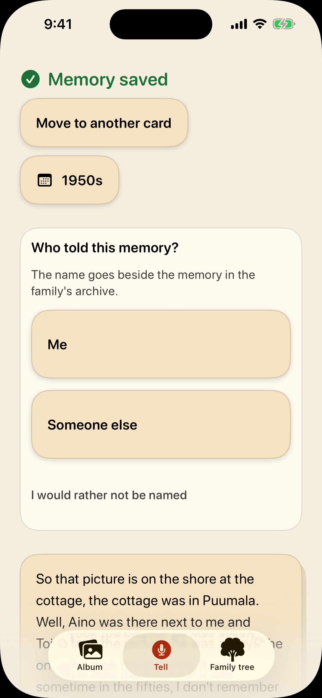

This is the full write-up behind the [README](../README.md).

<p align="center">
  <picture>
    <source media="(prefers-color-scheme: dark)" srcset="logo/lockup-dark.svg">
    
  </picture>
</p>

<p align="center">
  <a href="../LICENSE"></a>
</p>

A family's shared memory archive. Anyone in the family tells what they
remember, out loud or in writing, and the AI gives it structure: memories
attach to photos and people, the people and places named in the stories are
proposed for the family to confirm, and open questions come back to be asked.
The family tree is drawn from the people the family confirms and the
relationships it enters by hand.

Album and genealogy apps ask for structured input: a form to fill in, a face to
tag, a date to pick. A family's memory is not kept that way. It is told, a
little at a time and by different people, and whatever nobody wrote down goes
when they do. Kinlore keeps the telling and does the sorting itself.

Everyone tells into the same archive from their own phone, and the app is built
for the oldest teller as much as for the youngest. My own grandparent tested
it, which is why the rules further down read as constraints rather than good
intentions, and why the failure that matters here is not a crash but a story
that never got told.

Built for the [RevenueCat Shipaton 2026](https://revenuecat-shipaton-2026.devpost.com/)
hackathon. Target category: **Next Gen Award** (student category).

**Reading it as a judge:** this page, then
[`ARCHITECTURE.md`](ARCHITECTURE.md) — §1 for what is built and what is
not, §6 for the money — then the code both of them name. The RevenueCat half is
mapped file by file under [**Who pays**](#who-pays), and the app builds and runs on a
simulator with no keys and no Apple team (**Setting it up**, step 1).
[`CLAUDE.md`](../CLAUDE.md) is not product documentation: it is the working
agreement of the AI coding sessions that did most of the typing, and
[`DEVELOPMENT.md`](DEVELOPMENT.md) is its long form, much of it about several of
them sharing one tree. Read them after the code, not before.

## The one thing it does

> A grandparent, or anyone else who wants to tell, presses a big button and
> talks about an old photo. The app returns: the memory in their own voice
> and in readable words, attached to the photo; the names and places it
> heard, each with the sentence it was heard in, waiting for a person's yes;
> the time as it was said — and two questions back.

<p align="center">
  
</p>

<p align="center"><sub>Simulator, stub pipeline — the telling and the model call are canned, the wait is held six seconds longer so its step can be read, and a debug launch argument does the scrolling.<br>Reproduce it, and every picture on this page, with <code>scripts/readme-shots.sh</code>.</sub></p>

```
audio → ASR (Finnish) → raw_transcript (kept verbatim)
                             ↓
                     LLM extraction (structured output)
                             ↓
     ┌───────────────────────┼───────────────────────┐
memory.body           mentioned subjects      follow-up questions
(cleaned text)        (confirmed = 0)         (prompt_question)
```

|  |  |
|---|---|
| **Telling.** One button, and a way out of it for anyone who would rather type. Two questions wait under it for anyone who does not know where to begin. | **What comes back.** A later telling in the example archive. The names it heard wait for a cross or a tick, because no name enters the family tree before somebody confirms it. Above them, as the GIF shows, the date is a decade because that is what was said. |

Everything else in the app exists to make that loop worth repeating. What is
built and what is not is inventoried, honestly, in
[`ARCHITECTURE.md` §1](ARCHITECTURE.md#1-where-things-stand) — including a
warning about why that inventory has been wrong before.

### And then it asks

The follow-up questions are not a list to read. The app speaks one, listens for
the answer, organises what it heard, and asks the next — round after round,
without a tap. That matters because the person it is for should not have to
operate anything while she is remembering:

<p align="center">
  
</p>

<p align="center"><sub>Two rounds, hands-free. The timer counts real seconds, not a cut.<br>Reproduce it with <code>scripts/readme-shots.sh</code>, which runs <code>-screen interview</code>.</sub></p>

How the questions are chosen, and why they get more personal only as the
answers earn it, is the question ladder in
[`ARCHITECTURE.md` §12](ARCHITECTURE.md#12-the-question-ladder).

The voice asking is the phone's own speech synthesiser, reading the question on
the device (`InterviewVoice.swift`). It is the only voice the app makes: the
teller's is kept as it was recorded (rule 3) and never synthesised.

## Six of the ten rules that do not bend

The other four, and the full text, are in [CLAUDE.md](../CLAUDE.md#rules-that-do-not-bend).

1. **The primary user is whoever wants to tell, often an older person.** Dynamic
   Type up to XXL, VoiceOver, large tap targets. If a new screen does not work
   at the largest text size, it is not done. Colours come from `Elder.swift`,
   never from `.secondary` or the system blue — every one of those measures
   below the contrast minimum, and contrast is the one rule eyes cannot check.
2. **Telling is never paywalled.** The paywall limits photos, AI minutes and
   colourisations, not the act of writing or dictating a memory.
3. **The original audio and the raw transcript are always kept.** The speaker
   may no longer be around to ask. `memory.audio_r2_key` and
   `memory.raw_transcript` are not intermediate steps; they are the product.
4. **AI proposes, a human confirms.** A person or relationship inferred by the
   model is created with `confirmed = 0` and never appears in the family tree as
   fact. A wrong relationship is worse than a missing one.

   The strongest confirmation is a blind one. When a name was heard in a
   telling about a photograph, the app later shows that photograph and asks
   *Who is in this photo?* over three or four of the family's names, the
   proposal unmarked among them — so choosing it is recognising the person,
   not agreeing with a name already on the screen. Any other answer (another
   name, or *I do not remember*) confirms nothing and is never called wrong:
   the app does not know who is in the picture either. Nothing on that screen
   names the proposal, not even the photograph's VoiceOver label, and
   `BlindConfirmationTests` checks every text, button and image on it
   ([`ARCHITECTURE.md` §23](ARCHITECTURE.md#the-blind-confirmation-built-30-aug-2026)).

   <p align="center"></p>
   <p align="center"><sub>Simulator, <code>-seed film</code> — the photograph is generated for the shot, and nobody in it exists.<br>One of the four names is the proposal, and nothing on the screen says which.</sub></p>

5. **Uncertainty is stored, not rounded.** "Sometime in the fifties" goes into
   `date_start`/`date_end` with precision `decade`. No date is forced.
6. **No login screen.** Identity is a UUID in the Keychain; you join a family
   through an invite link.

## The core of the data model

A single `subject` table covers photos, people, places and events; a `memory`
attaches to any subject. That is why *"write a memory about this photo"* and
*"tell us what grandmother was like"* are the same screen and the same code
path, and why the family tree is just the edges between person subjects.
Schema: [`backend/schema.sql`](../backend/schema.sql).

|  |  |
|---|---|
| A person card is the same screen as a photo, because a person is the same row. *Add a relative* near the top is the point: a gap is an invitation, not an error. | One archive, several members, one shared quota. The quota belongs to the family rather than to whoever paid for it — see **Who pays**. |

## How to check any of this yourself

Several parts of this app fail *silently* — they keep working, look right, and
are wrong. Each one has a check of its own rather than a promise:

```bash
./scripts/verify.sh
```

That runs everything below that costs nothing and says what it skipped and why.
What it deliberately leaves out is argued in its header: nothing that spends
model credit, because a script you run twenty times a day must not cost money.

CI runs that same script rather than a reimplementation of it, so the two cannot
drift apart — but on pull requests and on request, not on every push. The Swift
checks in it need macOS, and that schedule was set while this repository was
private, where a macOS minute is metered at ten and a run the meter refuses
fails in four seconds. Every push gets the backend type check, on Linux, now
that the repository is public; while it was private a push ran nothing,
because the included minutes were spent and a refused run looks exactly like a
broken build.

| Claim | Command |
|---|---|
| Every screen works at XXL text, with VoiceOver, at sufficient contrast | `xcodebuild … test` — 406 UI tests, 127 of them an accessibility sweep at both text sizes |
| One purchase unlocks one family, and never a second | `node scripts/entitlement-binding-check.mjs` |
| The paid archive is offered after a telling on a rhythm, never beside a name a human is being asked to confirm, never on a grandparent's phone and never where there is nothing to buy — while the purchase beside a ceiling the family has hit stands on every phone with a store | `swiftc … scripts/upsell-rhythm-check.swift` |
| A place's looked-up coordinates follow its title through sync, a point somebody placed stays where they put it, and rubbish is refused | `node scripts/place-sync-check.mjs` |
| Extraction gets Finnish names, dates and relations out of a transcript | `node scripts/extract-tests.mjs` |
| The whole pipeline runs end to end | `scripts/smoke-pipeline.sh` |

The last three need a Worker running (`cd backend && npm run dev`), and the last
two an OpenRouter key in it as well — they spend model credit, which is why
`verify.sh` leaves them out. The first three need only Xcode and node. The full
commands, with the arguments this machine forces, are in
[`DEVELOPMENT.md`](DEVELOPMENT.md#commands).

## Measured, not claimed

**The ASR engine was chosen by measurement**, not from memory:
`scripts/asr-bench.mjs` over 3 Finnish texts × 4 degradation steps × 5 models,
on 31 Jul 2026 — and run again on 30 Aug with an English set of the same shape
beside it. The second run's numbers sit in
[`backend/wrangler.jsonc`](../backend/wrangler.jsonc) beside the setting they
justify. Both runs sent the bench's own system prompt, which is shorter than
the one `backend/src/transcribe.ts` sends: the same instructions to write
exactly what is heard, tidy nothing and mind the proper nouns, without its
lines on an elderly speaker, unfinished sentences, fillers, quotation marks
and silence. The numbers are that prompt's.

**Two of them are bad, and they are printed here on purpose.** The chosen model,
`gemini-3.6-flash`, scores 65 % on Finnish proper nouns against the bench's own
tripwire of 80 %, and a word error rate of 37.3 % against its own *"above 30 %
is not usable"* — on synthesised speech, which is kinder than the real voice of
an older person. The run that chose it read 68 % and 37.8 %, so both runs missed
both bars. English, in the second run, reads 60 % on names and a word error rate
of 29.9 %: below the name bar too, and a tenth of a point inside the other.

**Measured again on 1 Oct 2026, through the app's own path.** The same twelve
Finnish and twelve English samples went to a local Worker's `/transcribe`, so
the model heard `backend/src/transcribe.ts`'s full prompt rather than the
bench's, and the bench's own metrics scored the text
([`scripts/asr-worker-bench.mjs`](../scripts/asr-worker-bench.mjs), one run).
Finnish proper nouns came out at 89 % on clean speech, 100 % on quiet speech,
72 % with room noise and 28 % on the hardest step, which is quiet, noisy and
muffled at once: 72 % over all four, still under the bar. The word error rate
was 12.4 % clean and 31.4 % over all four. The one name missed in clean speech
was heard and lost its case ending (*Sotkamoon* written as *Sotkamo*). On the
hardest step the model did not leave gaps: it wrote a different, fluent story
with two of the right first names in it, which is the strongest argument yet
for keeping the recording and asking a person. English read 100 % clean and
quiet, 72 % with noise and 0 % on the hardest step. Each step holds only seven
names in three short texts, so one name moves it by fourteen points or more,
and it is still synthesised speech.

The concept was not dropped anyway, and
[PLAN.md §8](PLAN.md#risk-2-honestly) argues why in full: the original audio
is always kept and is playable, the raw transcript is kept beside the cleaned
text, and names are checked by the teller in the seconds after telling — or
corrected from the person's card years later. *One proper noun in three being
wrong is the premise the name-correction step was written for, not a surprise.*

**Accessibility:** 0 failures across 17 audits, measured 15 Aug 2026 on a
private simulator — every sweep there was that day, and the last whole-suite
run on record with no red in it. The suite has grown to the count in the table
above, and the last full run, the rehearsal of 30 Sep at `6032d58`, ran 398
tests with 19 skipped and one red, a colour test that passed when run alone a
second time and whose cause was fixed in `82f9e07`. The header of
`AccessibilitySweepTests.swift` keeps the tests that go red in company and green
alone, rather than explaining them away. (On a simulator shared with another
session, the 15 Aug commit reported 15 failures that were not real — see
[`DEVELOPMENT.md`](DEVELOPMENT.md#commands).)

But the number is not the argument. This is one screen at the default text size
and at the largest one iOS offers, which is the size rule 1 is actually about:

|  |  |
|---|---|
| Default | Accessibility XXXL |

Nothing is clipped and nothing is truncated — the screen gets longer instead.
That is rule 1 in one pair. It is also why the sweep opens each screen and audits
it at both sizes rather than trusting a screenshot at one: a screenshot shows the
top of a screen, and clipping happens further down.

An audit shares that limit on a screen taller than the phone: it judges only
what the accessibility tree holds, and a list builds only the rows near the
screen. So the two setup forms, Family (*Perhe*) and all three states of
Settings are audited page by page at the largest size, and Help, *How this
works* (*Näin tämä toimii*), and the album by decade are still judged there
only as far as the first screen reaches.
The comparison that found it sits behind `KINLORE_XXXL_LOSS` in
`AccessibilitySweepTests.swift`.

## What I got wrong

This is the first project where I wrote my mistakes down instead of quietly
fixing them. Five that cost real time, kept here because a repo that lists only
what worked is not telling you how it was built:

**I wrote things down as done before they were.** Nearly every row of
`ARCHITECTURE.md` §1 was marked finished while it was not, and every one of them
*looked* finished: the transcription that waited for a text nothing was
bringing, the deletion the client never sent, the rate limit that existed only
in the document, the accessibility audit that measured the wrong screen and
passed. They were found by reading a promise and then checking the code meant to
keep it — never by using the app, which behaved perfectly in all four cases.
That is this project's failure mode, and it is why the checks in the table above
exist as scripts and not as intentions.

**I set a tripwire and then walked past it.** The plan called Finnish ASR risk
#1 and told me to settle it *before any app code*. I measured five engines
properly — and then never ran the actual go/no-go on real elderly speech, which
is the half that decides anything. What I do have says 65 % on Finnish proper
nouns against my own 80 % bar. The concept survives because of how the app is
built, not because the number is good; the argument is in
[PLAN.md §8](PLAN.md#risk-2-honestly) and it is the part I would most like
a judge to read.

**I corrected a fact in the wrong direction, confidently.** `CLAUDE.md` used to
state which Xcode was installed here. It was wrong, I "fixed" it — backwards —
and wrote the new wrong version with more certainty than the old one. Following
it fails as *"Invalid runtime"*, which reads like a broken Xcode and is not one.
The entry, now in [`DEVELOPMENT.md`](DEVELOPMENT.md#environment-notes), says:
measure before editing this line, and paste the output rather than a remembered
number.

**I carried five candidate names for a year without checking any of them.** Two
were already taken outright, by apps doing this same thing. Checking costs one
HTTP request. Worse, the check I eventually wrote has two blind spots that both
bit me: reserved-but-unshipped names are invisible, and the API only sees the
App Store — *Saga* looked free while Saga plc sells insurance and cruises to 2.7
million over-50s in the UK, which is the same demographic as this app.

**I chased a red test run for an evening.** Fifteen accessibility failures,
contrast and clipping, on a screen that passes on its own. Another session was
using the same simulator. Measured afterwards: 15 failures shared, 0 of 17
private, same commit, minutes apart. The tests were not lying about the screen;
they were lying about which process they had hold of.

## Who pays

**The payer is not the beneficiary.** Grandmother does not buy a subscription —
the grandchild does, and the whole family's archive opens for every member.
RevenueCat grants the entitlement to the buyer; the backend maps it to a
family-level right (`family.entitlement`). For an audience whose ability to pay
sits in a different person than the one producing the value, that is the only
model that works. Details: [`ARCHITECTURE.md` §6](ARCHITECTURE.md#6-money).

Purchases run on the **RevenueCat Test Store** — there is no App Store release,
by decision ([PLAN.md §2](PLAN.md#2-why-next-gen-only)).

**What the free tier limits** is three meters, counted on the server because a
counter on the phone can be edited (`backend/src/quota.ts`): ten minutes of
transcription a month, twenty photographs in all and five colourisations a month
(`backend/wrangler.jsonc`). Writing a memory is none of them (rule 2), and a
recording over the limit is kept with its transcription deferred, not refused
(rule 3).

**How a purchase becomes the family's** is four pieces, all in
[`backend/src/entitlement.ts`](../backend/src/entitlement.ts) and routed in
`backend/src/worker.ts`, each with a check that needs no key, no Worker and no
network:

| Piece | What it does | Check |
|---|---|---|
| `POST /entitlement/sync` | The phone says *this customer bought something* and sends only the customer id. The Worker asks RevenueCat's REST API what that customer actually owns and writes the family's right from the answer, so editing the app unlocks nothing. | `scripts/entitlement-sync-check.mjs` |
| `POST /webhook/revenuecat` | RevenueCat's subscription events, authenticated by a shared secret. Only an expiry, a transfer and a refund take the tier away: turning auto-renew off keeps the month somebody paid for. | `scripts/webhook-revocation-check.mjs` |
| Reconcile | A stored paid tier whose date has passed is the one state that cannot be true, so RevenueCat is asked again. If it cannot be reached, the family keeps what it had. | `scripts/entitlement-reconcile-check.mjs` |
| One purchase, one family | A unique index on `member.rc_app_user_id` in `backend/schema.sql`: the same customer cannot unlock a second family, and a restore inside the family moves the binding. | `scripts/entitlement-binding-check.mjs` |

Each check loads the real `schema.sql` into an in-memory SQLite, the first three
drive the real functions with RevenueCat's side stood in for, and
`./scripts/verify.sh` runs all four.

On the phone the SDK is configured in
[`RevenueCatPurchases.swift`](../ios/Kinlore/Services/RevenueCatPurchases.swift),
the paywall is RevenueCatUI's own view (`PaywallSheet.swift`) — its design and
products are configured remotely in RevenueCat's dashboard, not in this code —
and a purchase reaches the Worker through `EntitlementClient` in
`PurchaseService.swift`. When the paywall is offered is `UpsellRhythm.swift`,
checked by its row in the table further up.

**A clone has no paywall to open.** It appears only with a RevenueCat key, and
none is in the repository: a Test Store key in a public clone would hand the
paid tier on the production Worker to anybody, and its model bill with it. The
paywall and a Test Store purchase are in the demo video, and with the Test
Store key `./scripts/try-it.sh --paywall` opens them against the deployed
Worker (README, [*See the paywall*](../README.md#see-the-paywall)). To see them
on your own, run the `Kinlore` scheme with a Test Store key of your own
(**Setting it up**, step 3) against a Worker that has `RC_SECRET_KEY` — without it
`/entitlement/sync` answers `503`, because it will not take the phone's word. A
DEBUG build with `-seed` and no backend address skips the server and opens the
archive by itself (`Session.syncPurchase`), which is how the film's take is
made. What your own RevenueCat project needs for all of this — the
entitlement, the offering and its paywall, the secret key's permission and
the webhook — is in
[`SETUP.md`](SETUP.md#revenuecat--the-project-behind-the-keys).

## What a family costs to run

This is arithmetic, not a bill: token counts from the code and from the
measurements recorded beside it, multiplied by public prices read on
30 Sep 2026. Every assumption is numbered below, because every one of them
moves a figure, and the [README](../README.md#what-a-family-costs-to-run)
carries the two tables that come out of it. In short: a recorded minute costs
about 3.3 ¢, a colourisation 3.6 ¢ and keeping a photograph next to nothing, and
a paying family has no ceiling in this build.

**Four calls cost money**, all of them through OpenRouter under
`data_collection: "deny"` (rule 8). Nothing else in the app calls a model. The
interview loop speaks its questions in the phone's own voice
(`AVSpeechSynthesizer`, `InterviewVoice.swift`), and each answer is an ordinary
telling that goes through the first two rows. The follow-up questions are a
field of the structuring's reply, not a call of their own.

| Call | Model (`wrangler.jsonc`) | What it sends | `max_tokens` | Attempts |
|---|---|---|---|---|
| Transcription, `POST /transcribe`, `transcribe.ts` | `google/gemini-3.6-flash` | the audio, a system prompt of 633 characters in Finnish (644 in English) and a one-line request | the answer's budget plus 4 096 for reasoning, at most 65 536 (`budget.ts`) | one; a failure keeps the audio, which is sent again later |
| Structuring, `POST /extract`, `extract.ts` | `google/gemini-3.6-flash` twice, then `openai/gpt-4o-mini` | a system prompt of 2 792 characters, the JSON schema (1 883), the question level (867), the archive rule (506) and the archive itself (about 380), the photograph rule (1 325), the photograph (a flat 1 140 tokens, measured) and the transcript | twice the transcript's tokens plus 3 072, at most 65 536, and 16 000 on the fallback | three |
| Story, `POST /story`, `story.ts` | `google/gemini-3.6-flash` | a system prompt of 2 503 characters and every live telling on the card, up to 40 of them, 8 000 characters each and 40 000 in all | 6 000, or 1 500 plus half the tellings' characters if that is more; reasoning capped at 1 024 | two |
| Colourisation, `POST /colourise`, `colourise.ts` | `google/gemini-3.1-flash-lite-image` | the photograph (up to 8 MiB), an instruction of about 480 characters and what was told about the photograph, up to 8 000 characters | not set | one a round |

**What bounds a call, and what bounds a family.** A transcript with more words
than 4 a second in Finnish or 6 in English, plus 20, is thrown away as invented
(`MAX_WORDS_PER_SECOND` in `budget.ts`). One request carries at most 25 MiB of
audio (`MAX_AUDIO_BYTES` in `worker.ts`), about 97 minutes at the app's
4.5 kB/s, or a photograph of at most 8 MiB. An answer in the interview loop ends
after 25 seconds of silence or at 10 minutes (`AnswerWatch.swift`); the first
telling has no limit of its own. The free tier's three meters belong to a
family: 600 seconds of transcription a month, 20 photographs in all and 5
colourisations a month. Every AI call a free family makes also draws on one of
four pools a day shared by all free families, 36 000 seconds, 300 000
structuring tokens, 20 rounds and 300 000 story tokens, which `wrangler.jsonc`
prices at about $14 a day at their worst
([`ARCHITECTURE.md` §7](ARCHITECTURE.md#7-quotas-and-moderation)). Structuring
and stories count against no family's meter, since a meter on structuring would
stop a typed memory (rule 2), so for them the pools are the only bound. The only
rate limits are per address, on creating a family (five a minute) and on joining
one (ten a minute). No route that calls a model has one.

**A paying family meets none of it.** `isPaid` is the first thing
`checkAISeconds`, `checkPhotoCount`, `checkColourisations` and
`reserveFreeTierDay` ask in `backend/src/quota.ts`, and when it is true each
lets the call through without looking at what has been used. The minutes and
rounds are still recorded (`recordAISeconds`, `recordColourisation`), so the
family screen can say what was used, but nothing compares them with a limit.
What still bounds a paying family is the size of one request and the credit on
the OpenRouter account.
[PLAN.md](PLAN.md) names a fair-use ceiling of five hours of transcription a
month, and says itself that it is a sentence and not code.

**The prices**, read on 30 Sep 2026:

| What | Price | Source |
|---|---|---|
| `google/gemini-3.6-flash` | $0.75 a million tokens in (text, audio and image), $3.75 out, reasoning included | [OpenRouter's model list](https://openrouter.ai/api/v1/models), read at 12:06 UTC |
| `openai/gpt-4o-mini` | $0.15 in, $0.60 out | the same |
| `google/gemini-3.1-flash-lite-image` | $0.25 in, $1.50 for text out, $30 a million image tokens out; a round measured at 3.39 ¢ from the reply's own `usage.cost` on 13 Sep 2026 | the same, and `wrangler.jsonc` |
| Audio | 32 tokens a second, 1 920 a minute | [Gemini API, audio understanding](https://ai.google.dev/gemini-api/docs/audio) |
| OpenRouter | the providers' prices unchanged, and 5.5 % on buying credit | [OpenRouter pricing](https://openrouter.ai/pricing) |
| R2 | $0.015 a GB-month, $4.50 a million writes, $0.36 a million reads, no egress | [R2 pricing](https://developers.cloudflare.com/r2/pricing/) |
| D1 | $1.00 a million rows written and $0.001 a million read, past the allowances | [D1 pricing](https://developers.cloudflare.com/d1/platform/pricing/) |
| Workers | $5 a month at least; $0.30 a million requests, $0.02 a million CPU milliseconds and $0.60 a million log events, past the allowances | [Workers pricing](https://developers.cloudflare.com/workers/platform/pricing/) |
| Apple | 15 % commission in the Small Business Program, for up to $1 million of proceeds the year before | [Small Business Program](https://developer.apple.com/app-store/small-business-program/) |
| Apple and tax | prices include VAT outside the US and Canada, and the commission is taken from the price after it | [Understanding taxes](https://developer.apple.com/help/app-store-connect/making-payments-to-apple/understanding-taxes/) |
| RevenueCat | nothing up to $2 500 of tracked revenue a month, then 1 % of all of it | [RevenueCat pricing](https://www.revenuecat.com/pricing/) |
| Finnish VAT | 25.5 % | [Vero](https://www.vero.fi/en/businesses-and-corporations/taxes-and-charges/vat/rates-of-vat/) |

**The assumptions.**

1. Finnish speech runs at 2.04 words a second, the rate `budget.ts` measured,
   which is 122 words a minute. English runs at 3.01.
2. A Finnish word is three tokens and an English one 1.6, the generous figures
   `budget.ts` budgets with, so a Finnish minute is 367 tokens of transcript.
   Prompts are three characters a token in Finnish (`story.ts`'s own figure)
   and four in English.
3. A transcription reasons for 1 500 tokens. `budget.ts` records 566–980 on a
   40-second telling, Finnish running past a cap of 1 024 five times in five,
   and up to 2 792 on hard samples.
4. A structuring writes 1 300 tokens plus twice the transcript, which fits what
   `budget.ts` records: 1 314 and 1 451 at 8 words with a photograph, 1 735 and
   2 376 at 126 words.
5. Every telling is about a photograph and has an archive behind it, the
   dearest structuring there is. Without either it costs 0.94 ¢ instead of
   1.26 ¢.
6. The story is composed once for each telling, as `StoryPlan` asks, on a card
   of four tellings, so each telling is read two and a half times and written
   two and a half times. Each composition reasons for its whole 1 024 tokens and
   reads 150 characters of the card's own lines, the schema, and 10 tokens of
   byline a telling. Nothing in the repository measures what a story costs.
7. Every text call costs 12 % more for retries, the failure rate `extract.ts`
   records, with every failure paid in full. A provider that crashes does not
   always bill, so this leans high.
8. OpenRouter's 5.5 % is added to every model price.
9. Recordings last a minute. Part of a recording's cost is the same whatever its
   length, the prompts, the photograph and the reasoning, so this assumption
   moves the price of a minute more than any other.
10. A photograph is about 1 MB (the app's own measured 340–990 kB), audio is
    0.27 MB a minute, and half of all colourisation rounds are kept, at 1 MB
    each.
11. Cloudflare is priced past its allowances, as if they were already used up:
    20 D1 rows written a telling and 10 a photograph, ten syncs a member a day
    reading 50 rows each, five requests a telling, and 5 ms of CPU and two log
    events a request.

**One Finnish minute**, tokens times price, then × 1.12 for retries and × 1.055
for OpenRouter's fee:

- Transcription: in, 1 920 tokens of audio and 221 of prompt, 2 141 × $0.75/M =
  $0.00161; out, 367 and 1 500 of reasoning, 1 867 × $3.75/M = $0.00700. That is
  $0.00861 at list and **1.0 ¢** paid.
- Structuring: in, 2 592 of prompt and schema, 1 140 of photograph and 367,
  4 099 × $0.75/M = $0.00307; out, 1 300 + 2 × 367 = 2 034 × $3.75/M =
  $0.00763. $0.01070 at list, **1.3 ¢** paid.
- Story: in, 929 of prompt, card and schema and 2.5 × (367 + 10), 1 872 ×
  $0.75/M = $0.00140; out, 2.5 × 367 + 1 024 = 1 942 × $3.75/M = $0.00728.
  $0.00869 at list, **1.0 ¢** paid.
- Together $0.0280 at list and **3.3 ¢** paid. An English minute is 2.8 ¢.

**A recording costs 2.1 ¢ plus 1.2 ¢ a minute** by the same sums, so what a
minute costs depends on how long the recordings are: 7.6 ¢ in twenty-second
answers, 3.3 ¢ in one-minute recordings, 1.9 ¢ in three-minute ones, 1.6 ¢ in
five and 1.3 ¢ in twenty.

**The rest.** A typed telling of 50 words costs 1.05 ¢ to structure and 0.74 ¢
to compose, **1.8 ¢**. A name correction that runs a telling's structuring
again, without the archive or the photograph, is about **1.0 ¢**. A colourisation
round is 3.39 ¢ × 1.055 = **3.6 ¢**, and 8 000 characters of told text add
0.07 ¢. A 1 MB photograph kept for a month is $0.015 ÷ 1 000 = $0.000015,
**$0.015 a month for a thousand**, and its upload and twenty deliveries cost
$0.0000117 once. An hour of audio, 16 MB, is $0.00024 a month.

**What a sale leaves.** A US price carries no VAT: 39.99 × (1 − 0.15 − 0.01) =
**$33.59** a month, and 149.99 ÷ 12 × 0.84 = **$10.50** a month for the year. A
sale in Finland pays VAT first: 39.99 ÷ 1.255 × 0.85 − 0.40 = $26.68, and $8.34
a month for the year. Without the Small Business Program the commission is
30 % in a subscription's first year, which leaves $27.59 and $8.62. RevenueCat's
1 % starts only past $2 500 a month and is counted here anyway.

**The scenarios**, at the twelfth month, so that a year of storage is in them:

- **(a) A free family at its three limits.** Ten one-minute recordings,
  10 × 3.31 ¢ = $0.33; five rounds, 5 × 3.58 ¢ = $0.18; twenty photographs and
  the Cloudflare, under a cent. **$0.51**, and nothing is paid. The three limits
  leave two things open. The month is checked before a call and counted after
  it, so a recording that starts under the limit passes whatever its length: at
  the 25 MiB cap its transcription costs about $0.30, and its structuring, which
  needs more than the model can write (below), fails three times for about
  $0.60. And typing is never metered (rule 2), so a free family's typed
  tellings, 1.8 ¢ each, are bounded only by the shared pools.
- **(b) A typical paying family**, taken to be five tellers who record twenty
  minutes each, twenty colourisations and fifty new photographs, among eight
  members: 100 × 3.31 ¢ = $3.31, 20 × 3.58 ¢ = $0.72, Cloudflare $0.03.
  **$4.05**, which leaves $29.54 of the monthly plan (88 %) and $6.45 of the
  yearly (61 %).
- **(c) A heavy family**, twenty tellers who record an hour each, 200
  colourisations and 200 photographs: 1 200 × 3.31 ¢ = $39.70, 200 × 3.58 ¢ =
  $7.15, Cloudflare $0.22. **$47.08**, which is $13.48 more than the monthly
  plan leaves and $36.58 more than the yearly. The same hours in five-minute
  recordings cost $19.26 and the month $26.63, which the monthly plan covers
  with $6.96 left and the yearly does not, by $16.14.
- **(d) Break-even.** $33.59 ÷ 3.31 ¢ = 1 015 minutes, about 17 hours of
  one-minute recordings, or $33.59 ÷ 3.58 ¢ = 939 rounds. The yearly plan's
  $10.50 buys 317 minutes, 5.3 hours, or 294 rounds. After Finnish VAT, 807
  and 252 minutes.

The heavy family's Cloudflare in full: 0.62 GB added a month and twelve months
of it kept, × $0.015 = $0.112; R2 writes, 1 500 × $4.50/M = $0.007, and reads,
1 500 × 20 members × $0.36/M = $0.011; D1, 26 000 rows written × $1/M = $0.026,
and its reads a fraction of a cent; 42 400 requests × $0.30/M = $0.013, their
CPU $0.004 and their log events $0.051. That is $0.22, under half a per cent of
the family's model bill. The Workers plan's $5 a month belongs to the account,
not to a family.

**What moves the figures most** is the length of a recording, above. Then the
size of a card: a story is composed from every live telling on the card each
time one lands, so its share of a minute is 0.7 ¢ on a card of one telling,
1.0 ¢ on four, 1.6 ¢ on ten and 4.6 ¢ at the cap of forty, where the whole minute
comes to 6.8 ¢. Then reasoning, which is most of every call's output: each
500 tokens of it is 0.22 ¢ a call. And the ceiling on what the model can write.
A structuring writes about twice the transcript over its floor (assumption 4),
and that passes the model's 65 536 output tokens at about 10 700 Finnish words,
87 minutes of speech. A recording that long is transcribed, but all three of its
structurings are cut off and paid for, and the telling lands in its teller's own
words.

**Checked against what was measured.** The one cost the repository records over
many rounds, 81 ¢ for 95 structurings with a photograph on 29 Sep 2026
([`ARCHITECTURE.md` §12](ARCHITECTURE.md#12-the-question-ladder)), is 0.85 ¢ a
round at list price, and the sums above give 0.89 ¢ for a telling of 50 words.
Two name corrections on 28 Sep 2026 cost $0.0157
([§17](ARCHITECTURE.md#17-the-name-that-was-heard-wrong)), 0.79 ¢ each, against
0.81 ¢ here for a one-minute telling; their length is not recorded. An older
round, $0.0061 on 19 Sep 2026 for a telling of about 215 characters with its
photograph (§12), is a quarter below the $0.008 these sums give it. So the
structuring figure is close to the latest measurement and leans high against the
older one. Transcription and the story have no measured cost in the repository,
and their figures rest on assumptions 3 and 6.

**PLAN.md's figure leaves out the reasoning.** The price decision of
12 Sep 2026 put transcription at about 0.3 ¢ a minute and said that everything
else but colouring rounds to nothing. That counts the audio and the transcript
but not the reasoning, which is most of the call, and the structuring and the
story each cost about what the whole transcription does, so a minute comes to
eleven times that figure.
The five hours a month PLAN.md names would cost about $9.90 at these figures,
against the $10.50 a month the yearly plan leaves.

So in this build nothing but the size of a request and the account's credit
bounds what a paying family spends, and a family that records more than about
17 hours a month on the monthly plan, or five on the yearly, costs more than it
pays.

## The cloud question, unanswered in public

Who hands a dead parent's voice to somebody's server? What is true today, rather
than what is comfortable.

**What the server keeps and cannot read.** Since 24 Aug 2026 the memory bodies,
the raw transcripts, the subject titles, the question text and the bytes in R2 —
the photographs and the voices — are sealed on the phone before they sync, and so
are the facts and the story on a card, which came later. The key
never reaches the Worker; between people it crosses only inside the invite text.
`scripts/lever3-roundtrip-check.swift` puts two identities through a real
deployment and checks both halves: that what lands in D1 and R2 is sealed, and
that the second phone opens it byte for byte.

**What it can still read** is the more useful half, and
[`ARCHITECTURE.md` §18](ARCHITECTURE.md#18-places-on-a-map--the-three-columns-and-what-they-cannot-promise)
lists it exhaustively rather than in outline: the family's own name and its
members' display names, timestamps, the dates with their precision, audio
lengths, relationships, the graph of which memory names which subject, and the
coordinates of places, with who placed a point by hand and when. That last one
is a decided leak and not an oversight — for a family's most-told places a
coordinate is the name in different clothes — and the argument for keeping it
in v1 is written down beside it.

**What passes through it in the clear is another list.** The recording goes to
the Worker unsealed, and the Worker hands it to a model provider through
OpenRouter to be written down — a model cannot transcribe speech it cannot
hear. The transcript then goes the same way to be structured, with the title,
date and place of the subject it is filed under, the names already linked to
it, the questions still open on it and, for a telling about a photograph, the
photograph (`ExtractionContext.swift`). A photograph leaves once more when
somebody asks for its colours, with the memories told about it, and that button
says so before anything is sent. When a card's story is composed (`/story`), the
tellings about it go the same way, with the card's title, date and confirmed
names and who told each, and the story that comes back is sealed before it
syncs. Every one of those requests carries
`provider: { data_collection: "deny" }`, the flag that keeps the words out of a
training set (rule 8, checked without sending anything by
`scripts/data-collection-check.mjs`), and the Worker writes none of it down:
transcription and colouring keep only their meters, extraction and a story keep
nothing, and R2 receives only what `/media` is handed, which is sealed. So
"cannot read" is a claim about what is *kept*.
End-to-end in the strict sense — a server that never holds the plaintext at
all — is incompatible with server-side transcription, and sealing at rest does
not close that hole.

**What the user is told, and when.** Since 16 Aug 2026 the create and join forms
say before their button that the recording is sent to be written down and that
the original is kept (`WhereMemoriesGo`; `ConsentOrderTests` checks at both
text sizes that it is on screen whenever the button is), and the create form
offers an archive kept to one phone, which sends no recording and transcribes
nothing (the guard in `TellViewModel.stopAndProcess`). Since 30 Sep 2026 that
is a quiet button under the form's own, *"Keep the memories on this phone
only"* (*"Pidä muistot vain tässä puhelimessa"*), and its confirmation says
where the memories stay before anything is set; until then it was the form's
first question, *"Who this is between"*. `LocalModeTests` walks that button
to the mode and pins what the mode says, not the guard itself, and its header
says why. Since 26 Sep 2026 the notice,
the Help screen and the microphone prompt say that the recording goes through
OpenRouter to a model, and the notice and Help add the photograph that has
travelled with a telling about one since 19 Sep 2026
([`ARCHITECTURE.md` §12](ARCHITECTURE.md#12-the-question-ladder)). They
promise one thing about it, the one the flag enforces: none of it trains a
model. What a provider keeps is that provider's policy, and the app does not
state it on anybody's behalf.
The notice, the mode and the sealing are three of the four levers priced in the
last item of [PLAN.md §10](PLAN.md).

**And there is a second credential: an Apple account.** `family_key` carries
`kSecAttrSynchronizable`, so it reaches every device signed into the same Apple
ID. The resilience and the way in are one mechanism, and
[`ARCHITECTURE.md` §4](ARCHITECTURE.md#4-identity-and-family) says so
instead of presenting only the half that flatters.

What the repo does guarantee: `OPENROUTER_API_KEY` exists only as a Worker
secret, `provider: { data_collection: "deny" }` is unconditional and never a
per-call flag, and an upstream error's own words reach neither the client nor
the log. The app gets `{ error: "upstream_failed" }`. The Worker's log gets the
HTTP status and the provider's own error code, and never an upstream body:
those can echo back the memory that was just told, and Workers Logs is a store
the family can neither export nor clear.

## Layout

| Directory | Contents |
|-----------|----------|
| `ios/` | SwiftUI app. The project is generated from `project.yml` with XcodeGen. |
| `backend/` | Cloudflare Worker + D1 (metadata) + R2 (photos and audio). |
| `scripts/` | The checks in the table above, plus `asr-bench.mjs`, `asr-worker-bench.mjs` and the logo tooling. |
| `docs/` | `PLAN.md` (scope, schedule, risks), `ARCHITECTURE.md`, `SETUP.md`, `UX.md` (the arc between the screens), `VIDEO.md` (the demo video's shot list), `RECOVERY.md` (when something on the server has gone wrong), `logo/`. |
| `.claude/` | The Claude Code setup the sessions here share: the [guideline file](../.claude/skills/karpathy-guidelines/SKILL.md) they work under — vendored, MIT, [why](DEVELOPMENT.md#the-assistants-rules--checked-in-not-personal-setup); a hook in `settings.json` (`hooks/big-read.sh`, `hooks/big-read.mjs`) that stops a whole-file read of a large file; and a `bulk-reader` subagent (`agents/bulk-reader.md`) that reads many files and reports file:line facts. |

## Setting it up

**Prerequisites:** Xcode 26 or later (built here with Xcode 27.0, tested on an
iOS 26.5 simulator), XcodeGen (`brew install xcodegen`), Node 22.18+.
**Nothing from Apple beyond Xcode** — no paid developer account, no
certificates, no Sign in with Apple. The two push
notifications are the one exception, and nothing waits on them. What else is not
needed, and why, is in [`SETUP.md`](SETUP.md#what-is-not-needed).

**To try the app rather than work on it**, run `./scripts/try-it.sh` from the
repository root, as the README's [*Try it*](../README.md#try-it) says. It
generates the project, builds the `Kinlore Production` scheme into
`build/try-it`, makes a simulator of its own and opens the app there, so what
is said reaches the deployed Worker and is heard. `--two` does the same on two
simulators, to share one family, and `--example` opens `-seed large`, an
invented family's archive a year or two in, on stubs and only when asked.
`--paywall` opens the Debug build against the deployed Worker with a RevenueCat
Test Store key in its settings, because the SDK stops a Release build given
one (README, [*See the paywall*](../README.md#see-the-paywall)). It
installs nothing and touches no simulator it did not make. The steps below are
the long way round, and the one to develop on.

### 1. The app on its own — no keys, no backend

```bash
git clone https://github.com/sunnyflower123/Kinlore.git
cd Kinlore/ios && xcodegen generate && open Kinlore.xcodeproj
```

Pick an iPhone simulator and press Run. The `Kinlore` scheme builds Debug, and
a simulator build needs no signing team — `ios/Signing.xcconfig` names none. A
phone does need one of your own, and
[`SETUP.md`](SETUP.md#ios-app--signing-for-a-real-device) has the one file
it goes in. **The app is fully usable on stubs**: record or type a memory,
watch it come back structured, browse the people it proposed. That is
deliberate rather than a demo mode — development must not stop when the Worker
is broken or there is no network — and it means anyone can try this without an
account of any kind. The paywall is the one thing missing, because it needs a
RevenueCat key; **Who pays** says why none is included. What the stubs cannot do
is listen: a recording comes back as one of three sample tellings in turn, in
the phone's language, whatever was said (`StubTranscriptionService`), and only
a Worker hears what you actually said: your own, through the `-api` argument in
step 3, or the deployed one, through the `Kinlore Production` scheme — a
Release build, which has the production address compiled in
(`AppServices.productionURL`). Create the archive on the app's first form
rather than *Keep the memories on this phone only*, because a phone kept to
itself sends nothing (`Session.keepToThisPhone`); the family is then made on
the deployed Worker, and the free tier's limits apply to it, as **Who pays**
gives them.

Run `xcodegen generate` again after changing `project.yml` **and after adding or
removing a source file** — XcodeGen globs the sources, so a new `.swift` file is
invisible to `xcodebuild` until it runs.

### 2. The backend, locally

```bash
cd backend && npm install
printf 'OPENROUTER_API_KEY=sk-or-...\n' > .dev.vars
npm run db:local   # FIRST TIME ONLY — this creates the tables, it does not migrate them
npm run dev
```

`.dev.vars` is gitignored — **check anyway before your first push**, because the
repo is public. One key covers both halves of the pipeline: OpenRouter has no
separate transcriptions endpoint, so audio travels as an `input_audio` part of a
chat completion. That key lives only in the Worker, never in the app; unpacking
an IPA is trivial and a leaked key is a real bill.

```bash
curl -s http://localhost:8787/health
```

`{"ok":true,"hasKey":true}` means the key is in place. If `hasKey` is `false`,
extraction answers `502 upstream_failed`, and the Worker's log records the
status, 401, and nothing more.

### 3. Point the app at it

In Xcode: Product → Scheme → Edit Scheme → Run → Arguments.

| Argument | Effect |
|---|---|
| `-api http://localhost:8787` | Real transcription and extraction instead of stubs |
| `-rcKey <RevenueCat Test Store key>` | Purchases, **in a Debug build only**. Without it the app works normally, minus the paywall |
| `-seed family` | A demo family on the free tier with no server behind it, in a Debug build. With `-rcKey` and no `-api`, Family tree → Settings (the gear) → Family members and invitations → Open the whole archive opens the paywall, and a Test Store purchase opens the archive without a server (`Session.syncPurchase`) |
| `-tryIt YES` | What the `Kinlore Production` scheme and `scripts/try-it.sh` launch with, in any build: until the archive's first telling, the Tell screen offers an example sentence to read aloud in place of its opening questions, and *Type it for me* puts it in the write field instead. The install remembers it (`TryIt`), and remembers `-tryIt NO` the same way |

**A Test Store key stops a Release build, by RevenueCat's design.** The app
compiles no key in: it reads `rcKey` from `UserDefaults` at launch, the same way
in every configuration (`RevenueCatPurchases.swift`), and with none it never
configures RevenueCat — no paywall, no crash. With a `test_` key, the SDK in a
build without the `DEBUG` flag shows an alert and then calls `fatalError`
(`checkForSimulatedStoreAPIKeyInRelease` in purchases-ios's
`Configuration.swift`; [RevenueCat's note](https://rev.cat/sdk-test-store)).
The `Kinlore` scheme runs Debug, so the argument is safe there. `Kinlore
Production` and an archive build Release: give them neither the argument nor a
`defaults write com.kinlore.app rcKey …` left on a simulator.

All three are optional, and there are about twenty more. The debug ones
exist because some states cannot be reached by hand at all — a refused
microphone, a family with no server behind it, an extraction that fails while
transcription succeeds.
They are what the UI tests and the demo video are filmed with, and they are
listed in [`SETUP.md`](SETUP.md#launch-arguments).

### 4. Your own Cloudflare resources — only for the cloud half

```bash
cd backend && npx wrangler login
npx wrangler d1 create memorize && npx wrangler r2 bucket create memorize-media
```

Put the returned `database_id` in [`backend/wrangler.jsonc`](../backend/wrangler.jsonc),
and your own RevenueCat project's id in `RC_PROJECT_ID` beside it, push the
schema to the remote database with `npm run db:remote`, then add the three
secrets ([what each is for](SETUP.md#backend--as-worker-secrets)):

```bash
npx wrangler secret put OPENROUTER_API_KEY   # and RC_SECRET_KEY, RC_WEBHOOK_SECRET
```

In RevenueCat, point a webhook at `/webhook/revenuecat` on your Worker with an
Authorization header of exactly the value you gave `RC_WEBHOOK_SECRET` — the
Worker compares the two and answers `401` to anything else.

The Cloudflare resources keep the old project name `memorize` on purpose: an R2
bucket cannot be renamed, only recreated empty, and rule 3 lives in that bucket.

Two months of development cost under €20 in total — the estimate, item by item,
is at the end of [`SETUP.md`](SETUP.md#cost-estimate-during-development).

## Building and testing from the command line

The UI tests need a simulator of their **own** — they install, launch and
terminate one bundle id, and two runs on one device kill each other's process
and report accessibility failures that are not real. Create one and hand its
UDID to `scripts/verify.sh` as `KINLORE_TEST_SIM`; with it set, the script runs
the UI suite after its other checks, and without it, it skips the suite and says
so:

```bash
cd ios && xcodegen generate && cd ..   # verify.sh skips the UI suite without the project
xcrun simctl list runtimes             # pick an installed iOS runtime's identifier
SIM=$(xcrun simctl create kinlore-tests com.apple.CoreSimulator.SimDeviceType.iPhone-17-Pro <runtime-id>)
KINLORE_TEST_SIM=$SIM ./scripts/verify.sh
```

Give a simulator by UDID rather than by name: a `name=` destination that more
than one simulator answers to fails as *"Unable to find a device matching the
provided destination specifier"*, which reads like a missing simulator and is
not one. Building, and the UI suite on its own with the language flags
`verify.sh` gives it:

```bash
xcodebuild -project ios/Kinlore.xcodeproj -scheme Kinlore -sdk iphonesimulator -destination "id=$SIM" build
xcodebuild -project ios/Kinlore.xcodeproj -scheme Kinlore -sdk iphonesimulator \
  -destination "platform=iOS Simulator,id=$SIM" -testLanguage fi -testRegion FI test
```

The tests run in Finnish because they find what they tap by the words on
screen, and those words are the Finnish strings the app uses as its
localisation keys. On a simulator in any other language the app shows the
English from `en.lproj`, and a test looking for *"Tutut nimet"* meets
*"Familiar names"* instead.

If `xcode-select -p` points at the Command Line Tools rather than at Xcode,
prefix `xcrun` and `xcodebuild` with
`DEVELOPER_DIR=/Applications/Xcode.app/Contents/Developer`. `verify.sh` does
that for itself whenever Xcode is at that path.

## Two languages, on purpose

The repo is written in **English**: docs, comments, identifiers, commit
messages. The app's user interface is **written in Finnish**, because it was
made first for Finnish tellers, many of them older — and it **speaks English by
default**, because the app has to be shown to people who do not read Finnish. A
Finnish phone still gets Finnish, and Settings → *Language* (*Kieli*) chooses
English or Finnish on any phone, from the next time the app opens: it writes
the same per-app setting iOS keeps (`AppLanguage`), and *Same as the phone*
(*Puhelimen kieli*) removes it. The Finnish source strings are the lookup
keys, so writing a new one still means writing Finnish;
`scripts/localisation-check.mjs` fails if it has no English.

The pipeline follows **the language the app is shown in**, as the closest guess
at who is speaking: there are two system prompts and two hallucination
ceilings, and the app sends `lang` from its own localisation. So a Finnish
grandmother telling into a phone set to English gets the English prompt, which
`SpokenLanguage` admits where it is defined, unless Finnish is chosen in
Settings, which moves the screen and the prompt together. The English prompt is
not the Finnish one translated — its first rule teaches a model about case
endings that English does not have. The test transcripts stay Finnish because
they are the input under test. The boundary and its exceptions are spelled out
in [CLAUDE.md](../CLAUDE.md).

## Licence

[Apache 2.0](../LICENSE).
